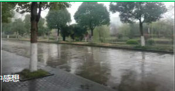

### 作者 小宝

我今天上了一天的课，从态度，人际交往，到从众心理，暗示和社会传染，到爱情和婚姻。我仔细思考了人民圣殿教的悲剧，正好老师放的视频是一件谣言引起民众恐慌，整个人好像都受到消极暗示了，觉得很可怕，正好外面下雨，想到自己好多事拖着，心情糟糕。于是我想去老师聊一聊，老师说，那些人都是为了满足某种需要而自愿加入，接受了，慢慢被同化了。我不禁想到德国的电影，die Welle，本来只是一个实验，最后竟走向失控。我说，这和历史上的极权组织很像，如 红色高棉，还有权利高度集中的前苏联，这些人为什么最后会没有一点怜悯之心。老师说，同化，就像洗脑了。而且统治者高高在上，就像金字塔一样，一部分是完全认同了，还有一部分人则是在威压之下不敢反对。我说，就像有人想上梁山泊，就得杀个人作为投名状。真的很可怕。老师说，关键还是人有那个需要被满足的欲望。最后说的是爱情，大学生很多是游戏式的，哎，不说这个了，我也许还没到那个阶段吧。最后那个雨真的很大，我不禁感慨自己空有屠龙之技，却连个雨伞也不带。在门口站了好久，有位大妈好心借我伞，我真的很感动啊。回到那空空的屋子，衣服没洗，坏了的灯没换，还不容易写完开题报告德福作文还没写，明天又要去南京。心理学上反复强调形象的重要，我偏偏这样子。还伞的路上，我一路默念，屈原放逐，乃赋离骚，孙膑短足，兵法修列，仲尼厄而春秋作，韩非囚秦，说愤孤难，不韦迁蜀，世传吕览。此人皆有所郁结，退论书策以舒其愤。及孙子短足，丘明失明，终不可用，思垂空文以自现。我忽然明白，这些孤独之于我不就像屈原遭遇遗弃，我怎么可以退缩。康德说心中的道德律令，开始我还奇怪，如果说星空象征神奇的自然奥妙，道德除了约束还有什么呢，其实心理学上这应该叫内化的道德。想到这里，我想到生命的底色，两个字 高贵。不同流并且自重。但是之所以做事还有所欠缺，在于一点，李宗吾所说，不够厚黑。锯箭法补锅法还嫩了点。我以鲁迅为榜样，夜深人静的时候，他依旧在思考，战斗。

