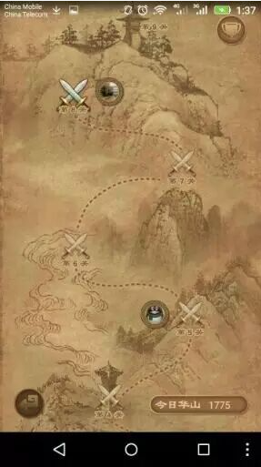

### 作者: 高小宝

很久很久以前，高中时我在QQ空间写过一个很怪的文章，高级的爱是改变状态的。估计很多人不知道我在表达什么，不过也有老同学鼓掌。那个时候我的认识还很狭窄，如今我可以做更为细致的论证。从曹雪芹说起，贾宝玉初试云雨情，有人可能一下子在脑补东京热什么的，其实不是的。贾宝玉梦中喊可卿就我，他此时正如曹雪芹所言，鸿蒙初辟，未知情为何物，处于探索感知阶段。在这里可以举很多明星的例子，我喜欢的民谣歌手宋冬野，如果你听董小姐可能以为谁失恋了，但当你听安河桥，你开始明白他为什么说爱情是高级动物聊以解愁的幻想。警幻仙姑告诉他意淫和皮肤滥淫的区别，其实是作者的理解。有点像川端康成老了之后的一些作品。

很多人不能理解正是在于这里，就像他们不能理解男人愿意反串角色，吃雌性激素，甚至是变性。性是天生的，有的人生来就是带把的，有的就不是。但是性别却是后天形成的，我听说美国没有男女之分，有偏男，偏女或者中性。法国作家波伏娃写过一本书叫第二性，也许就是在讨论这个问题。

我还有一个奇怪的看法，变性者都在努力实现对自卑的超越。比如金星以及很多这样的人，他们或者她们，就像司马迁被嘲讽被冷落仍含辱苟活，用自己的努力克服困难，最终被社会接纳。他们经历了男女俩种体验之后，对于爱情的理解已经不同于常人。不会像王安全那样，娶了张雨绮还出去拈花惹草。我比较好奇的是，没有生理基础，纯粹的超越，改变了状态，究竟好还是坏。也许，这回上天并没有预设答案。

上一次没发成，这回我加一点东西。我很有必要多一点男性朋友。我周围太多女性了，仔细想来，真的是太多了！作为一个男孩真的是的。不能太依恋女性。。。我简直不知道自己的身份了。我怀念一起喝酒潇洒的日子。
        
回过头来看自己写的东西真的是好奇怪，有什么好研究的。有功夫不如出去走走。而且我现在觉得感情原来也是一种稳定的东西，只有不自信的人才会患得患失。

