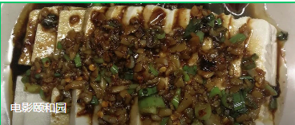

电影我是第二遍看了。我曾经屁颠屁颠去电影里的墓地去找李缇的墓碑，哪怕是一点痕迹也好。

李缇最后的自杀我实在没有明白。她和周伟上床，我能理解。毕竟她男友在德国柏林，一个人在国内寂寞难耐缺个人陪伴。但是去了德国后，她要是还贪图和周伟的鱼水之欢，我就费解了。至于什么爱情，自由，平等，总得有个度吧。

余虹正好相反，她先是在草地上，又是在大学的宿舍里，最后又是在一个已婚男人的家里，最后她还遇到了不嫌弃她过往的真心喜欢她的男人。女人三十，如狼似虎，真是再恰当不过了。我真的不懂文学家的修辞，在做爱中觉得男人才能理解她是善良的，气得我头疼。余虹还干了一件事，她教会了东东对着镜子自慰。
故事的背景音乐我最喜欢的是所有人刚上大学那一会儿，放的是青春舞曲。

里面的性关系是真的混乱，余虹的男朋友周伟和闺蜜李缇好上了，若谷和周伟在车子里一番对话，明显自己朋友比自己还了解自己老婆的内心世界，他们却能够彼此心照不宣的告别，互祝平安，这就是，成年人的世界？

这跨越十几年的情感纠葛真的是复杂啊！

比如，分手的理由是，我离不开你了。。。

