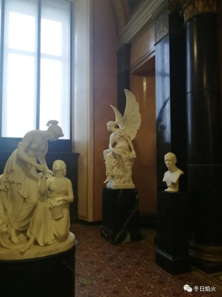
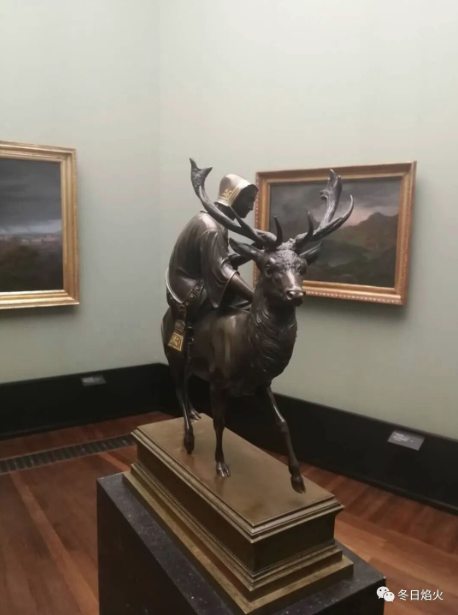
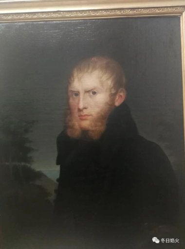

- 艺术给了我说真话的勇气

昨天徜徉在国家美术馆，看着画家记录着百年前人的装扮和日常生活，那被捕捉的一个个瞬间，我彷佛摆脱了压抑许久的东西。回到现实，我有了新的认识和领悟。下面，先放一张我最喜欢的雕塑，然后开始讲述。

开头永远讲最重要的，最重要的就是好友与我讲过的一些话。这些话，每每想起，温暖如初。当时，我追一个女生而不得，自己很痛苦，很压抑。张鲁津和我说了一句话，和女生相处重要的是，在一起要开开心心。一语点醒梦中人。但是我的性子就是固执，最终闹得我和她的闺蜜之间很难看。孟萌后来和我讲了一句话，单身的男生对女生有些想法是可以理解的。虽然她说的很婉转，但是我非常感谢，已经很不容易了。再后来，就是我念念叨叨和男女舍友们的矛盾，感觉自己被无视，像空气一样。万潇潇和我说了一句话，感觉我就像个孩子，像她高中的时候一样不成熟。我的心情，瞬间好了很多。想起和陈家盈一起逛宜家，我看到塑料花简直以假乱真，就说拿来送女朋友，一劳永逸。她说，第二天就会分手吧，真心是要用真心去换的。是啊。还有就是经常和朱梦杰互怼，别人都以为我们吵起来了。他说，我们其实很熟的。具体原因，且听下回分解。

接下来就是压抑我很久的事情了，我和我的舍友们。一开始是吉润，杨心怡，季月紫，后来季月紫回国了，李洋搬过来了。我们的关系没办法不走的近，因为共用厨房，卫生间，而且我们的自己的寝室门是不带锁的。换句话说，你不需要钥匙就能开对方的门，这就很微妙了。因为大家都是学生，自然一开始是希望能成为好朋友。我也是这么想的。但是后来摩擦不断，我不断地道歉，他们表示没办法容忍，就互不打扰吧。我的好朋友问我，听起来，你怎么和所有人为敌。吉润和季月紫在国内就认识了，季月紫说，吉润相当于过来投奔她的。杨心怡，吉润，还有后来的李洋是一开始在新常福打工认识的，经常在一起玩。说句题外话，新常福的菜偏辣，还搬过一次家，后来就关门了。之后，他们三个就去多得利打工，还是经常在一起有说有笑。所以，我要么不得罪，要得罪就全得罪。很多事情没有对错，有些事情忍一忍就过去了，要放大就会无限放大。就比如，有一次，我学的很晚回家忘记拔钥匙，被两个女的骂的不是东西。李洋说她上班路上都觉得心里不安，吉润自然也会跟着她们说我，你自己想一想，这是第几次了。我想，这要是在家，我跟我妈说我学的很晚回来，真的太累了。我觉得不管第几次，我妈第一反应，就是儿子太辛苦了，而不是指责我忘记拔钥匙这件事。从那一刻起，我和他们就不再是朋友了。

我是一个心里鲜有秘密的人，我觉得把秘密藏在心里太难受了。而且，任何事情，放在泱泱历史长河来看，都是微不足道的。但是我的三个舍友不是这样，吉润，季月紫，杨心怡。有一天晚上，只有我和季月紫在家。我看见季月紫在收拾东西，厨房基本是她的东西。她很宅，喜欢在家研究化妆或者尝试各种美食，缺点就是浪费并且不爱收拾。我想说几句，而且我也听到杨心怡在吉润面前说过季月紫。我就想着借杨心怡的话，说几句。我说，杨欣怡对你有意见。我下面一句还没说呢，季月紫脸色就变了，要哭的样子，然后硬要说她和杨心怡关系很好。我心想，糟糕，是不是闯祸了。结果还真是。不过，来教育我怎么做人的，不是杨心怡，而是吉润。后来，我和朋友说起这个莫名其妙的事情，他教了我一个词，塑料姐妹花。

后来我就开始怀疑自己，不断反思自己，是不是正如他们所说，我缺少共情。他们说，他们有时候能理解我的想法，而我却不能理解他们的想法。这有时候是个哲学问题，如果凡事为别人考虑，那将自己置于何地。我依稀记得，刚来柏林的时候，房东让我赶紧搬家，我就答应了，然后到处找房子。要么就是太贵，要么就是太远，没有合适的。我问了各种能问的人，还去了一次华人教堂。一个和蔼的德国老奶奶为我开了门，但是那个时候我德语还不好，就来了个华人。他示意我先出去，我就跟他又出了大门。他一手哄着孩子，一边跟我讲上帝是否存在。而我心里想的却是，可能明天或者后天，我就要流落街头，上帝在哪里呢，他在天国等着我吗?从那一刻起，我就坚定了一个信念，我要用自己的双手创造自己的幸福，这就是我的上帝。

读书，睡觉，吃饭，我干我自己的事，不管舍友怎么看待我。

虽千万人，吾往矣

