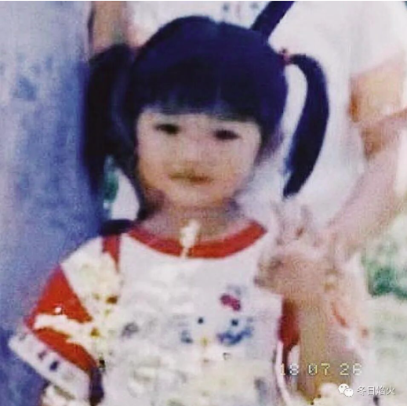
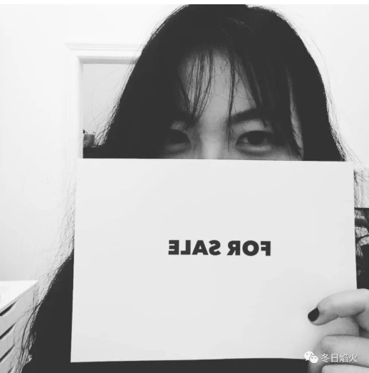

- 事与愿违

那天阳光正好，从ly的房间照进来，她把房间收拾的很整洁，正中就一张椅子对着窗户。似乎，没事的时候，她会坐着椅子看着窗外，对面的树木和邻居家的别墅。yxy在她房间挂了一串帽子，木格子上面有一些植物，她还有搅拌机，还有吉他，她，是一个热爱生活的人。jyz很宅，喜欢研究化妆和美食。jr是逗比加娘，然而内心是个直男。

我呢，我自己也不知道我是怎样的人。

一年来，他们都没有换过头像，而我一个月就能换几次。我一直在寻找自己的身份，不知道，该以怎样的观念，面对这个世界。然而，在和舍友相处的过程中，在旷日持久的斗争中，我建立了自己的处世之道。

我成长了。

本来我和舍友还有表面上的和气，双方还不至于撕破脸皮。因为一件小事，双方终于亮明了各自的观点。yxy和ly在五人的讨论组里，另外两个人是已经回国的jr和将要搬进来的zhry，发布了出房的信息，意思是让我走。我也没有客气，也发布了出房的信息，意思是你想走你走。（我们现在的斗争已经是一般人看不懂了）然后，她们两个女生就炸了。yxy过来说，我已经答应搬家了，我说我没有。她说我在耍无赖，我说你们在胁迫我。ly问我，你想怎么办。我说，谁住的不舒服，谁走。（貌似我的确是耍无赖，现在看谁更无赖）然后，yxy就说，现在开始我们碗还有厨房里面的油盐酱醋分开，钱也不和你计较了，你买的食用油，零钱给你。卫生间的卷纸，不好意思，是她买的，不给我用。我心想，这大半年来，我在学校吃，回来要么煮水饺，烤pizza，你买的酱油我基本没有用过。你把厕纸收到自己房间就过分了，不过，我的求生能力很强，我那么多打印纸，揉一揉，搓一搓，凑合。yxy还说，她要通过法律途径解决，我则对她说，欢迎和支持，希望法律会给我一个公道的裁决。

之后，我们就不再说话了。

不过，在这几天的斗争中，我学会揣摩人的心思，哪些话别人想听，哪些话别人不想听。在和家人的通话过程中，我也很少和我妈抬杠了，能够意识到自己哪些话是气话，也知道该怎么说，让我妈理解和接受了，这也算是一种进步吧。学会关注别人不经意的细节，来猜测其内心的态度。我还注意到了我爸妈没有观察到的细节。学会倾听和分析，连我爸妈都表示有理。

我本来是希望jr走后，大家还有新来的舍友和谐相处。但是第一天晚上，yxy把我一个人晾在外面客厅，拉着新来的妹子和ly去她房间吃饭。我一个人炒了番茄和鸡蛋，一个人在偌大的客厅吃了好久。第二天，我做了蛋糕，忙活了三个小时，本想着和舍友分享一下。ly说她在睡觉，yxy让我放在厨房。晚上我打算做宫保鸡丁，新来的妹子也在尝试新的菜谱。ly和yxy则约了另外一个妹子来玩。她俩开开心心向新来的妹子介绍朋友，无视在厨房的我。我没有忍住，一句话把她们的朋友气走了。ly接着就和我说，蛋糕她不吃了，我非常生气，本来我是很节约的人，但是我还是觉得自己要争气，就倒了。

之后，ly就和我一直板着脸，yxy倒还是客客气气，这点，我倒是很服。

ly的微信签名是粉色花岗岩石，yxy说ly还停留在初中，之后就没有成长过，jr说，那是个子吧。yxy是一个非常好强的人，微信签名是愿一生以歌。jyz有点轻微的抑郁。

大家出门在外，关系处成这样，我也是很难受。

