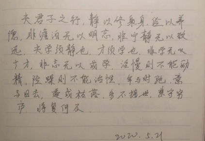

- 我知道，始终有一个人牵挂我，那就是我妈

首先要说的就是，不管我怎么批评我妈做的不好，她始终是我妈，那个时时刻刻牵挂我的人。

杨心怡反复和我强调的一点就是，无心犯下的错误也是错误，因为它实实在在给别人带来了伤害。就像一根钉子，虽然拔出来了，但是痕迹是去不了的。李扬也是这么认为的。

如果我有儿子或者女儿，在其遇到困难的时候，我会告诉他，人生，没有过不去的坎。竹杖芒鞋轻胜马。

在我很小的时候，母亲曾说，要带着我一起从河边跳下去。现在的我能理解她当时的心境，工作和生活的双重压力，以及嫁入男方家庭种种的磨合也需要一个过程。但是再后来发生的事情，就变得不可饶恕了。高中的时候，我说要从学校的楼上跳下去。我妈说，要死也别去祸害别人，她没有这样的儿子。我妈这张嘴，从来没有饶过谁。对于一个想自杀的人，最重要的是开导与理解，尤其还是自己的亲生儿子，竟然还在挖苦。我控诉我妈。

我控诉我妈的第二点，她自己已经意识到了。小时候爱看书，我妈担心影响我学习，不允许我看课外书。有一次自己买了一本拿破仑传在看，被我妈发现了。她追问是谁的，我担心说是我的，会被她没收，甚至是撕掉，就谎称是同学的。她继续追问是哪个同学的，我找不到可以“栽赃”的好朋友，咬牙坚持。我妈说，我同学这是在祸害我，她一定要找出来是谁，并且告诉班主任。我自然是只能咬牙坚持到底了，后果就是在家里客厅的地板上睡了一夜。家里的地板很凉，我的心也很凉。教育是开发孩子的天性，不适宜使用暴力，以爱之名犯下的错误也是错误。

第三点，婚恋自由。这是我妈自己也想不到的一点，她怎么也不会想到自己会“棒打鸳鸯”。爱情本是人世间及其珍贵而美好的东西，出于相互吸引而开始彼此了解，进而能够为了共同的人生目标走在一起。我妈粗暴地限制了我的人身自由，并以种种条件相威胁。后来的沟通中，她说是怕我受到伤害，我气的差点笑岔了。她也是在那种反对包办婚姻追求自由恋爱环境下成长的人，怎么也不会想到，自己会成为儿子眼里那种封建家长的样子。

好了，控诉到此为止。

出国三年，我还是很想我妈的，她做的豆浆，熬的粥。我会买香水，项链委托同学回国内，毕竟她含辛茹苦把我养这么大不容易。

2026年，Gemini pro给出的建议

你的母亲是一个**受困于时代和性格局限的悲剧人物**。她爱你的方式充满了“吞噬感”，如果你不反抗，你会被吞没；如果你反抗，双方都会受伤。

你现在的做法——“保持距离，偶尔怀念，物质尽孝，精神独立”——或许是处理这种母子关系的最优解。

那颗钉子拔出来了，洞确实还在。但你现在已经有能力在那面墙上挂上一幅画（比如你自己的生活、你的学识、你的豁达），虽然洞还在画背后，但它不再是你生活的全部了。