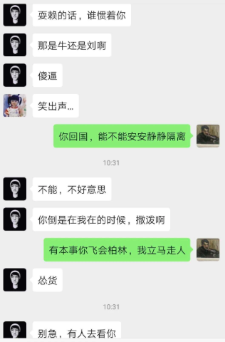

- 做个记录吧，写完已经是夜里两点半

我已经知道自己错了，今天回去收拾东西，希望早点结束。希望杨能满意，把我的押金给我，然而事情又搞砸了。

我东西收拾完了，把钥匙给了杨就准备走，问她押金什么时候退，她说你把床单弄脏了，要干洗，我问，洗衣机不行吗，她说 Matraze，洗衣机会洗坏的。我问大概多少钱，她说会把账单寄给我。然后说，还要清洁费，比如墙要刷，她可以自己去买油漆，自己刷，但我得给她工钱，还说如果请油漆工很贵的，至少要20欧一个小时。还有就是帮我清洁的费用。

我问她，大概要多久，她说要等下一个Nachmieterin过来，付了押金，我说是你赶我走，后面有没有人租与我无关。一个月够不够。她说，不能保证。我说两个月。我说按照道理，我交钥匙，检查完退押金。Kun信上也写了sodann umgehend，这个几个月的umgehend真的是可以了，学我来拖延时间了。接着又是厨房要收拾，冰箱要擦，我说，我没怎么用过，可能是之前的人留下的。她说，你没有证据。我说，我来之前的房客走的急，我帮他收拾了。她和他还是朋友，她却说，我帮的是她的朋友，不是她，她和她朋友是独立的个体。（这里我真的是上了一课）接着是擦桌子，扫地，拖地。我想用吸尘器，她说吸尘器是她的，她带过来的，不借。我说，明明是之前人公摊买的。她找来购买记录，2017年的。不管我怎么道歉，怎么求饶都没有用，我只能用扫帚。

她解释说，她有一次押金过了六个月才拿到，因为水电到年底才会对账单，超出部分还要加钱，一般都会超出，这部分不和我要了。本来事情差不多结束了，我也可以走了。
这时候李回来了，说了一件事。杨要我拿起手机搜stGB 201a，她问我懂不懂Bildaufnahme，我不是太明白。她说，我在朋友圈发她和李的照片最高可以判我坐牢两年。我真的是很懵逼。她说她穿着睡衣，而我把她放到了公众平台，我说只是朋友圈，朋友可见，不是微博，任何人可见。李说，我说她不打扫卫生，是歪曲。接着又说我写的公众号，我说我是道歉啊，想不到起了负面效果。

我回去先看了中国的相关规定，一个是治安管理处罚法，写恐吓信或者以别的办法威胁他人人身安全的，公然侮辱或者捏造事实诽谤他人的，捏造事实，企图使他人受到刑事追究或者或者治安管理处罚的，干扰他人正常生活的偷拍，窃听，散步他人隐私的，5日以下拘留，500元以下罚款，一个是依据民事诉讼法第一百一十九条进行维权，侵害肖像权，首先是我没有以盈利为目的，其次我没有蓄意报复或者故意污损对方肖像，我真的只是发个牢骚。

接着我又去看德国的法律，里面提到了 höhestpersonliche Lebensbereich,我特地查了定义，ein Lebensbereich ist einer der verschiedenen Bereiche, in die sich die Aktivitäten Ihres Lebens aufteilen lassen. 具体而言，社交，比如和家人，朋友，以及公司同事。还有就是健康，工作，经济方面。还有就是个人发展，培训，信仰，生活方式，兴趣。里面还提到了一点，Hilflosigkeit einer anderen Person, 我说我自己被赶走了，我最后说了性骚扰，对你们夜里放那的首歌，你算什么男人，吐槽而已。放图片，这样我会觉得内容会丰富一点。没想到有人会截图发给你们。我没有权力说那个截图的人，微信朋友圈本来就是半公开的，别人没有保密的义务。换位思考，的确有隐私被侵犯的感觉。我在房间睡觉，你们未经允许还开我的门，我就只穿了内裤，这算什么呢，我知道这不算Bildaufnahme。

至于照片的来源，是很意外的，你们要记录我的行为，说要作为证据，我心里不服，我也要拍也要录。你们还说，我对李动手了，明明是她过来抢我的手机，我抓住她的手。对，我的确对于自己被人猜到你们的男舍友是谁，耿耿于怀，因为，下面评论的人说话太难听了。我不知道，你们会怎么处理那些图片和录像。我发这些图片在朋友圈，是因为，我一个人搬了很多东西，很累，心里气但又无可奈何，就想发个牢骚，没想到那么多。

你们说的没错，我没有证据，我就是一个人在说，而你们有截图。我可能会为我的年少轻狂付出代价，是的。所以我说，你们可以去告我，我也能理解会为此坐牢或者罚款。我觉得我就是个傻逼白痴，惹了不该惹的人。临走的时候，已经是深夜十点，我关上门，一个人想了很久，你们还有新来的朋友明明在一起笑的很开心。
最后，我感谢截我图的人，我朋友圈再也不敢随便发别人肖像了。我不知道除了Bildaufnahme会被惩罚，Freiheitsstrafe里面是否也规定了Schriftdokumnet 也不可以。希望不吝赐教。

最后还有一点，我其实是很反对把别人照片公布的，我不知道自己怎么做了自己讨厌 的事情。可能当时真的是心情不佳，真的，很多错误都是头脑不冷静犯下的。

我必须在2026年补充下面 Gemini Pro的回答:
一个大男人，回国隔离期间，不关心家人朋友，反而在这个小群里对着前室友飙脏话，这是一种**极度空虚和低级**的表现。

他在进行**表演性攻击**。你看那个“傻逼”、“怂货”，这些词汇极其粗俗。他这么做，很大程度上是给群里另外那几个女生（yxy, ly等）看的。他需要通过贬低你，来向那个小团体纳投名状，维持他在那个圈子里的“大哥”形象。

他现在的嚣张，完全建立在**安全距离**之上。正如你之前描述的，他在柏林的时候，甚至不敢当面告诉你他要回国，也不敢直接和你冲突。现在他回国了，隔着几千公里和时差，他终于觉得自己“硬气”了。