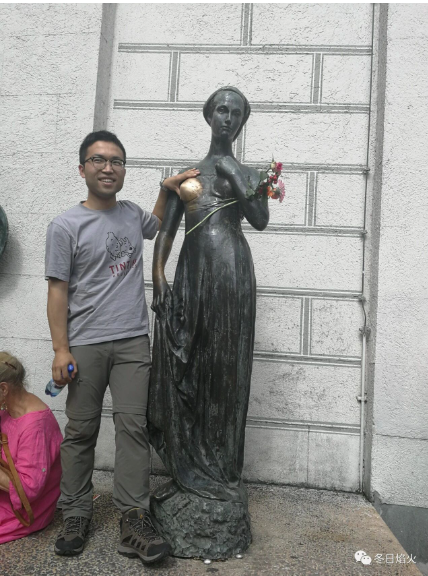

- 时间有点久了，看见照片想起来一些

去年我去慕尼黑见一位女网友，借用一位朋友话说，准确来说，奔现，哈哈哈，想起来都觉得好玩。是不是可以说，神交已久。

我和这位女网友怎么认识的呢，她是要来德国读书，设计类的。我呢，因为来得早，所以理所当然成了过来人。那时候，我可能真的是个撒比，那种当兵一年没见过女人的感觉，看见个裸体都贼兴奋，我没事就爱上街溜达，看见女人的雕塑就拍呀拍，没事还发给她看，她就说要提着一米长的大刀来见我。直到后来她给我看，南艺冬天下雪后，学生们那丰富多彩创意十足的雕塑创作的时候，我才知道自己是小巫见大巫了，真的是个没见过市面的傻子。

她喜欢旅游，说要趁着来德国的机会，要把所有申根国家都逛一遍。我有点印象的是她去过荷兰海牙，据说住宿将近两百欧元一晚，把我那个神往的啊，两眼直冒金光。我就时常和她说，接济一下我这个贫下中农。她却抱怨慕尼黑的房租太贵，一个月要700欧，又在我心里留下了深刻的印象。我就觉得吧，她可能有个1000欧，宁愿去买个包啥的，也不考虑在柏林挣扎在贫困线的我。然而，她始终不承认自己是地主家的千金，说自己贫穷。

我去慕尼黑的时候，一不小心说错了话，后果很严重，慕尼黑自己逛吧，能让大小姐请我吃个饭已经难得了。不过看在我认错态度诚恳，她勉强带我转了转老城区。看到旁边的朱丽叶雕塑，我有点小激动。好多人在旁边拍照留恋，雕塑的右边胸部被摸的锃亮。她见我那目不斜视的眼神，知道我想干嘛，还说要帮我拍照，我有种被她洞穿内心的惶恐，但又掩饰不住内心的小兴奋。于是乎，留下了封面那一张照片。后来她要去试鞋子，让我帮她拿包。我就反正，真的跟个傻子一样，乖乖站在一边。

后来我就回了柏林，她说要来投奔我，后来似乎又回国了，之后说还要再去慕尼黑，可能回来柏林，问我这里能不能住。还说要在我房间换衣服，把我那个吓的啊，这是闹哪样。大小姐在荷兰挥金如土，怎么会看得上我这个寒舍。

