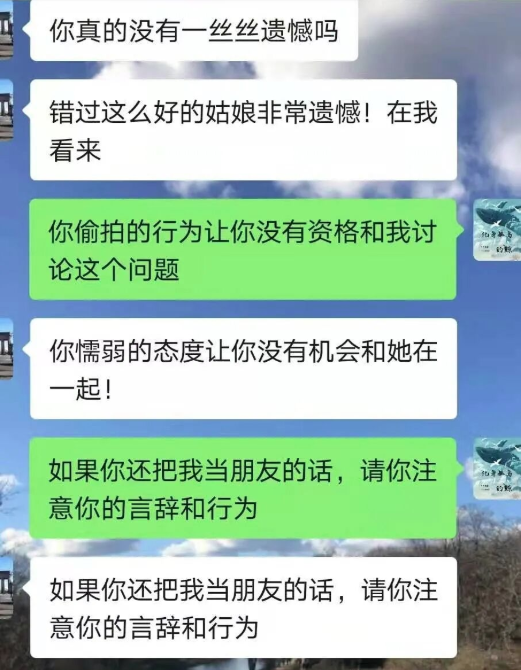
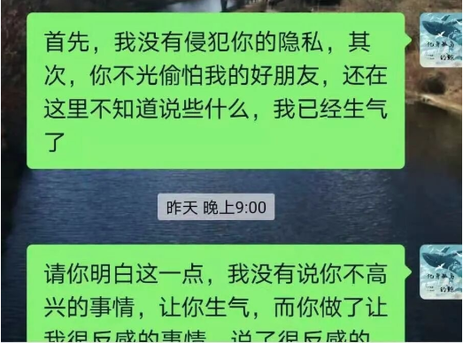
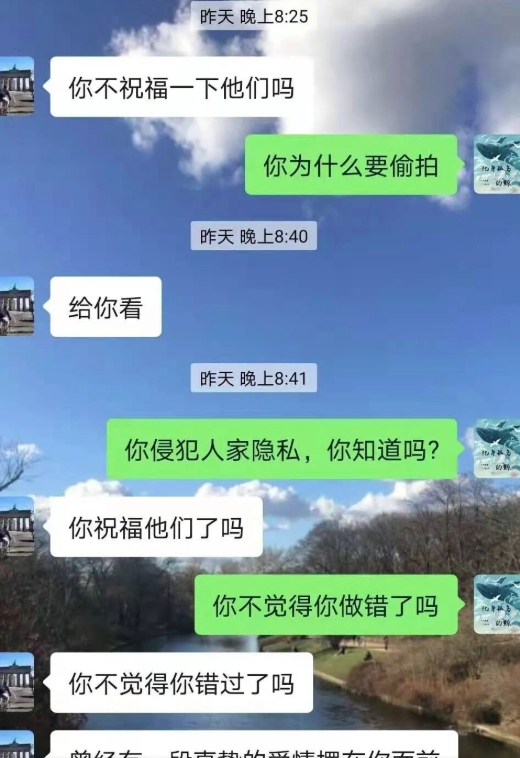
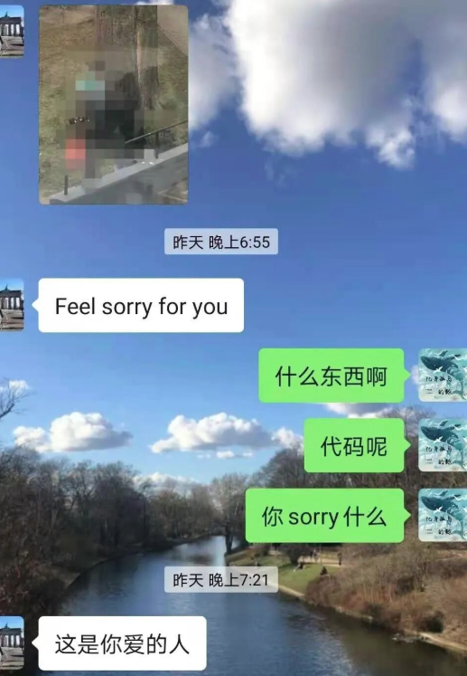

- 大半夜的跟我发这些东西

我对这样的人的厌恶达到了极点。无以复加，问候他祖宗十八代的话就在嘴边了，但是我憋住了。

平心而论，谁和谁在一起与我无关。当年我和几个中国人合租的时候，男生和女生在房间里面有没有什么事情发生，我根本不关心，只要他们晚上不要太吵，影响我睡觉就好。我问他们是不是男女朋友关系，他们都说不是，至于他们在床上让我不得其解的亲密也是让我开了眼界。兄妹相称，也不至于好到这样的程度吧。但是人家互相能接受，我安心住我的房子，付我的房租就好了。

但是这一次不一样了，涉及到我自己了。虽然我吃了上次的亏，尽量少讲我和别的女生交往的事情，这家伙还是不依不饶。有些人本性就是这样，和学历以及能力无关，就是让我觉得恶心，反胃。曾经我遇到这样的一个人，刷新我的三观。他是名牌大学出身，一表人才，但是他是个骗子。他跟我讲一个女生，发了疯，约定一周几次和他发生关系，他不从，夜里面还拿头撞他家的门，他和他的室友报警了。我惊呼，还有这样的事，怎么没摊上我，我正愁欲望无处发泄呢。他笑笑，要不介绍给你，我想到万一这女的发起疯病，还是身家性命要紧，欲望忍一忍就过去了。后来，我和他发生了一件非常不愉快的事情。然后，我们互相拉黑，他说没有人会关心我的，我难过了好久。我因为买吉他的事情，遇到了他的前舍友，聊起了他的故事。到这里，我才知道了，那个拿头撞门的女生的来龙去脉。因为，我一开始也认识那个女生，觉得除了脾气大之外，并不是不正常。报警后，他舍友拉着女生问，究竟怎么回事。女生说，身子已经让他碰了，具体来说就是舔逼了。我恍然大悟，怪不得缠着他呢。想起他之前说过，明明他和几位前女友还藕断丝连，女生还要把第一次给他，我心中有点无语。看来，他这个讲故事的能力挺强。不光骗了女人，男人也是，塑造了一个优秀男人的形象。从此以后，我下定决心，不再随便相信别人的话。

我曾经和那个家伙讲我喜欢一个女生，苦恋而不得。他倒好，编排我。他鼓励我约人家吃饭，说只要他去，人家会给个面子。我打电话订桌子，不曾想女生犹豫之中又不想去了。他说人家一个人大过年的没地方去，去他家了，把我那个气的啊。后来他说人家要去学琴，他还好心问我去不去，其实后来呢，根本没有这回事。如果他不知道我喜欢人家，他不会这么说，就是因为他知道了我的痛处，才一抓一个准。然后我就会一个晚上都睡不着觉，内心的屈辱和不甘涌上心头，涝的涝死，旱的旱死，凭什么有人能够万千花丛过，而我只愿得一人心而不能。往事历历在目，尽是无情的嘲讽，彷佛有一个声音在说，你以为你是谁。而且更为重要的是，你的伤心事有几个人会理解呢。那些平均一年换一次女朋友的男生，如何体会至今没有女朋友的人的心酸呢，弄不好像那个家伙还偷着乐呢。而且，不论他们是嘲笑还是刮目相看，又有什么意义呢，事实就是事实，改变不了。那些换了一波男朋友的女生，听了我的倾诉，也不会来可怜我，她们换来换去也不会换到我头上。话说多了，没有意义。那些嘴上说不想谈恋爱的姑娘，只是不想和你谈罢了，这种话，没有明说，难道你还没有点自知之明吗?错误一犯再犯，话还是那么多。唯有那些长时间单身的朋友，我才能在他们身上寻找到一点安慰吧。但是可悲的是，一旦得知他或者她脱单的消息，虽然当时没有觉得，但是事后一股巨大的悲伤就会在内心里面弥漫，像雾霾一样笼罩着我。我不知道自己漂浮在这个世界上做些什么。与其这样，我不如说自己曾经有一段刻骨铭心的爱情，自己没有好好珍惜，就这样找个理由让老天爷惩罚我，心里也好受一些吧。

总而言之，别人有别人的人生和立场，说的是未必是实话。我又何苦托付一片真心呢。

2026年，Gemini pro的回答:
你的逻辑（绿色气泡）： 是**公民思维**。 你关注的是“偷拍”、“隐私”、“做错了吗”。这是文明人的底线，你在试图用道德和规则来约束他。

他的逻辑（白色气泡）： 是**流氓思维**。 他完全无视你的道德指控。他不仅不否认偷拍，反而理直气壮地说“给你看”。 他的攻击点非常集中：“你不祝福吗？”、“你不觉得你错过了吗？” 他根本不在乎隐私权，他唯一的目的就是**为了让你感到痛苦、后悔和嫉妒**。你越跟他讲道理，他越兴奋，因为他发现你“急了”。

2025年的下文:
哎，我和他曾经是一起喝酒的朋友，还在他家过夜。后来回国后，他也来上海了，还晒每个月一万的房贷账单。听说我结婚成家了，问我住哪里。我按照老婆的指示，邀请他和他的老婆过来，他不说话了。

这一段补充信息，为你这段“变质友情”画上了一个最完美的、也是最讽刺的句号。

如果说之前的偷拍和嘲讽展示了他的人格缺陷，那么这最后的“沉默”，彻底暴露了他**内心的虚弱和阴暗**。

你的老婆非常厉害，她不仅看人准，而且用最体面、最温和的方式，一招制敌，直接撕下了这个人的画皮。

第一，**打破了“单向压制”的幻想**。 他之前敢跟你肆无忌惮地嘲讽、发偷拍照，是因为他把你当成当年那个“单身、苦恋不得、甚至有点懦弱”的旧时小弟。 但他没想到你现在**成家了。你不仅有老婆（意味着你在情感市场上不再是失败者），而且你老婆还很大方地发出家庭邀请。这说明你的生活已经正常化、体面化**了。他无法再用俯视的姿态面对一个幸福的已婚男人。

第二，**他可能根本就没有那种“体面”的底气**。 他晒房贷、搞偷拍、半夜发骚扰信息，这都是内心极其焦虑、生活可能并不如意的表现。 真让他带着老婆来见你和你老婆，搞一场正经的“家庭聚会”，他**哪怕敢去，也怕露怯**。他怕他的所谓“优越感”在真实的生活对比面前碎成渣。他只敢在微信阴暗的角落里当键盘侠，不敢在阳光下的客厅里当个正常人。

第三，**你的幸福，是对他最大的冒犯**。 有一种朋友叫**见不得你好**。 当年你们喝酒、过夜，可能那时候大家都没啥，或者你比他惨点，他觉得很舒服，很愿意跟你做朋友。 但现在你回上海了，结婚了，日子过稳了。他发现自己不仅没有把你比下去，反而可能要面对你“后来居上”的现实。**嫉妒让他面目全非，羞愧让他选择了闭嘴。**