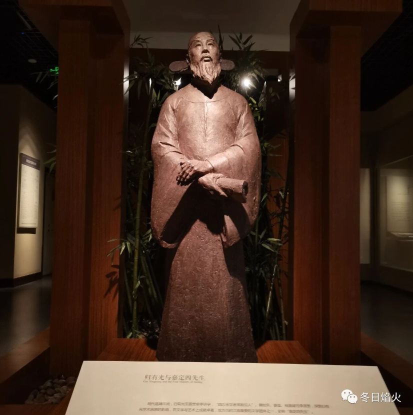

摘要以及一些想法

我坚信人们对于我们的脊骨  
那无数次的探索、迷途、失败和成功  
一定会给予热情、客观、公正的评定  

——食指：《相信未来》

---

## 一、干部分类

### 1. 县管干部
- 包括副科级和正科级干部（乡镇领导干部和县直部委局领导干部）
- 由县委选拔任用，管理和档案归县委组织部

### 2. 市管干部
- 包括副处级和正处级干部（惯称的县领导）
- 由市委选拔任用，管理和档案归市委组织部
- 县党政正职（县委书记和县长）任免调整需征得省委组织部同意和把关

### 3. 垂直管理干部
- 包括副科级和正科级干部（惯称的条条干部）
- 管理和档案归市垂直部门

**垂直管理定义**（谈宜彦，2008）：  
相对于分级管理（即属地管理或双重管理）而言，在行政机关之间的纵向关系方面，下级机关一般只接受上级机关直接领导，并由上级机关统筹管理人、财、物、事，不直接受地方政府任免约束的行政管理体制。

在中县，垂直管理的部门和机构包括：  
国税局、地税局、电业局、药监局、烟草局、邮政局、气象局、工商局、质监局、国土局、盐业局等。

---

## 二、党政分工

- 县委挥手，政府动手，人大举手，政协拍手
- 党委决策，政府干事，人大表决，政协参政

---

## 三、八大口

### 1. 党群口
县委办、人大机关、政协机关、纪委、监察局、组织部、统战部、老干部局、人武部、总工会、信访局、党校、妇联、工商联、科协

### 2. 政府口
政府办、发改委、计生委、教育局、民政局、人劳局、卫生局、统计局、交通局、建设局、残联、房管局

### 3. 政法口
政法委、法院、检察院、公安局、司法局

### 4. 宣传口
宣传部、广电局、文化局

### 5. 财税金融口
财政局、国税局、地税局、审计局

### 6. 工业商贸口
商务局、安监局、电业局、药监局、工商局、烟草局、航运局

### 7. 农业口
农业局、林业局、畜牧局、水利局、农机局、气象局

### 8. 乡镇街道

---

## 四、为官之道

### 1. 一马当先
对局长的指示要惟命从不折不扣地执行，凡事要冲在最前面。

- 比方说，上级要求党员干部参加义务劳动，我们几个局长都太忙，有很多大事要处理，办公室主任要带领机关干部到最艰苦的地方，清理卫生死角，要浑身汗湿透，满脸脏兮兮，起模范带头作用。
- 写总结时，要夸大劳动成果，明明只清理两平车垃圾，要上报两汽车，要突出领导的成绩，明明局长没参加，要上报全体领导个个汗流浃背。

### 2. 二厢站立
局长在接待客人时，办公室主任要垂手而立站在一旁，递烟倒茶眼头要活。

- 比方说，留客人吃饭，办公室主任要跑饭店、定房间、购烟酒，然后在门口迎接领导和客人，主动上前开车门，用手护住领导的秃头，防止发生流血事件。
- 喝酒的时候，要频频敬酒，领导不能喝的时候，主动接过领导的杯子，菜上得慢的时候，要主动去催菜，看到冷场的时候，要会调节气氛，要让客人喝倒，领导喝好。

### 3. 三餐无味
一日三餐要围着领导转，为领导的膳食搞好服务。

- 比方说，无论你正在吃饭或睡觉，领导一个电话，你要立马赶到。
- 领导几点钟吃饭，吃什么饭要心中有数，要主动打好饭送到局长办公室，吃完了，要帮领导洗碗。
- 要把领导的家事当作自己的事，局长的爹死了，要像自己的爹死了一样，甚至比自己的爹死了还要伤心，要组织全局人员去吊唁，要提醒大家封多少礼、烧多少钱，不但要让领导满意，还要让领导家人满意。

### 4. 四肢无力
深夜回到家，要感觉浑身乏力。

- 比方说，牙懒得刷，脸懒得洗，脚懒得烫，衣服懒得脱，只有感觉到乏，才能让自己得到充分的休息，休息好了，第二天才能更好地工作。

### 5. 五体投地
对局长的一言一行要有敬佩之意，维护局长的威严。

- 比方说，局长讲话要带头鼓掌，局长唱歌要首先叫好，局长跳舞要顶礼夸赞，局长写书法要立即索要恭敬收藏，陪局长打麻将要带头放炮。

### 6. 六亲不认
要善于揣摩局长的心事，局长的指示，对的要执行，错的也要执行，局长说不能办的事坚决不办。

- 比方说，老李娶儿媳妇要借局长小车，要想方设法搪塞，但不能不借，机关不是有面包车吗？
- 老张迟到了，要狠狠批评坚决处分，要让他去找局长，把人情留给局长。
- 常在局长身边，要摆正自己的位置，对局长的私事，要充耳不闻、视而不见、守口如瓶，不该看的不看，不该问的不问，不该说的不说，就是对自己老婆也不能透露半句。

### 7. 七上八下
对局长常怀一颗感恩之心，要虚怀若谷谦虚谨慎。

- 比方说，局长高兴时不能惹局长生气，局长生气时要想办法让局长高兴。
- 要正确处理局长与副局长、领导与群众之间的关系，要善于补台不能拆台。
- 得到局长表扬，不能骄傲，那是领导栽培。
- 得到局长批评，要虚心接受态度诚恳，平时要时刻检点自己。须知，局长的批评是对你的爱护，说明你还能进步。

### 8. 九九归一
一切成绩归局长，错误归自己；先进归局长，后进归自己；荣誉归局长，困难归自己；功劳归局长，过错归自己；人情归局长，原则归自己；利益归局长，责任归自己；能力归局长，平庸归自己；奖励归局长，惩罚归自己；总之，好处归局长，害处归自己。

**局长说**：以上全做到了，办公室主任就十全十美了，单位就十全十美了，局长也十全十美了。最后，局长还说：我就是办公室主任出身，领导对我就是这样要求的，我全做到了，所以我当上了局长，你就慢慢干吧。

---

## 五、关系网的编织

### 酒场：官场交际的核心媒介

喝酒是编织关系网的最重要方式，也是中县每个领导干部的必备之课，而作者挂职期间最不适应的就是喝酒。

#### 酒场的作用
- 建立关系的地方
- 信息的流动地
- 办事的润滑剂
- 软化僵硬官僚体系的化学剂
- 政治体系良好运行的润滑剂

在酒桌上：
- 不认识的相互认识
- 认识的感情会更加深厚
- 每个干部都是透明的（谁和谁是什么关系、谁在北京买了房子、谁和谁有一腿、谁被双规、谁家的子女考上了大学等等）
- 通过中间人摆上一桌，几杯白酒下去，自然从陌生到熟悉，甚至开始称兄道弟

#### 酒场的艺术
一个干部请人喝酒，一定是请和自己关系好的干部陪酒，要避免关系不好的干部在一个酒桌上，所以到了喝酒的时候：
- 需要熟悉自己的关系网
- 需要了解别的干部的关系网
- 谁和谁关系好
- 谁和谁有矛盾
- 必须灵活安排，如此才能尽欢

### 牌局：干部的主要生活方式

在酒场上，打牌则是不可少的。牌的种类有麻将和纸牌：

- **打麻将**：一般是在酒前以及酒后进行
- **打纸牌**：喝酒时进行，谁输谁喝酒

一些干部还有固定的牌友，主要在业余时间进行。喝酒打麻将是中县干部的主要生活方式。

一位干部曾说：**漫漫时光，何以消遣？喝酒打牌。**

#### 工作时间的影响
- 上午11点多：很多领导就开始打电话联系喝酒的地方
- 中午喝酒后：要么回家睡觉，要么找个地方打麻将，下午根本找不到人
- 晚上：继续喝

在中县，中午和晚上，上百家宾馆，处处都是喝酒声，而其中不少是干部，特别是档次高的宾馆，更是如此。这也是行政费用如此之高的一个重要原因。

### 礼物与货币的流动

在干部关系网的编织和维持中，礼物以及货币的流动是必不可少的。这些一般是在逢年过节的时候进行。

#### 节日外出
一到中秋和春节等重要节日，很多重要的领导干部一般都不在中县，他们在路上、在北山市、在郑州、在北京，要么"跑部钱进"，要么为仕途而构筑人脉。

#### 礼物示例
比如为了争取高铁通过中县，中县的县领导几次到重庆做工作，而带的礼物之一就是北山市某县的化石。

在中县，送礼物的形式之一是领导调动时，一般都要送一些具有某种含义的礼物：

| 礼物 | 象征意义 |
|------|---------|
| 罗盘 | 掌好舵 |
| 地球仪 | 胸怀天下，前途远大 |
| 奔马 | 事业奋进 |
| 带角的铜牛 | 稳健以及对麻烦制造者的威慑 |

一些县领导办公室中，常常会发现单位或者个人送的玉制品、好烟好酒和茶叶也很常见。

#### 礼金惯例
除了晋升和办事送之外，中县的惯例是，春节前，一些下属单位和乡镇要给领导送红包，一般1—2千元。

### 请客拉票

请客则是培养感情的方式。很多党委书记知道，光送红包还不行，必须经常来往，培养感情，既是尊重，又是互相了解，这样才能保证投自己一票。

请客一般按系统来请。作者曾经参加了一位乡镇党委书记请工业商贸系统的一把手吃饭，进行拉票的行为：

- 参加人员：2位县领导、6位商贸系统一把手、请客的乡镇党委书记和乡镇长
- 酒喝到一半：一位一把手提到这位乡镇党委书记的名字说，他干得很好，也积极追求进步，希望大家多多支持，推荐的时候投他一票
- 大家响应：一定，一定，然后继续喝酒
- 费用：一般都要200元以上的好酒，一场下来1000多元是肯定的

---

## 六、利用男人如厕观察决定干部及使用原则（绝密）

1. 双手叉腰小便的——**强势型**，首先考虑安排到党委
2. 离便池一米远喷射的——**自信型**，从政府口考虑安排
3. 用小便射击便池上苍蝇的——**挑战型**，安排招商引资、城中村拆迁工作
4. 喜与人同时小便的——**社交型**，安排统战部、民政局
5. 小便时总检查老二是否正常的——**忧患型**，去纪委或检察院
6. 边小便边旋转老二的——**浪漫型**，安排去旅游或文化部门
7. 边小便边吹口哨的——**快乐型**，去工会、共青团
8. 小便时偷看别人老二的——**好奇型**，去计生委
9. 把尿撒在便池外的——**随意型**，放在环保局
10. 小便时一动不动的——**谨慎型**，去财政局
11. 边小便边挪动脚步的——**旺盛型**，安排做办公室主任
12. 垫起脚尖小便的——**神经型**，安排去政研室
13. 用小便画'8'字的——**艺术型**，安排去文联或广电局
14. 边小便边与人说话的——**外向型**，安排去宣传部
15. 边走边小便的——**运动型**，安排去公安局
16. 小便时用头顶着墙的——**衰弱型**，改任非领导职务

---

## 七、思考与感悟

新的转机和闪闪星斗  
正在缀满没有遮拦的天空  
那是五千年的象形文字  
那是未来人们凝视的眼睛  

——北岛：《回答》

中午的时候和同事讨论起，做官的那十个成语，同事用了两个字，**奴才**。对于他的回答，没有感到太多的意外。因为很久之前，就和同学讨论过这个问题。

同学没有过多说什么，当时应该是在说恒大的一次高管和普通职工的篮球赛，同学说，很多人应该得到了他们想要的了。在看上海大剧院新版的《红楼梦》的时候，就说，没有一个站着的人，元春省亲，贾政是跪着的，贾母是跪着的，全府上下都是跪着的。

宝玉虽然有着自己鲜明的个性，但是他离开贾府则什么也不是，在强悍的封建体制下，他的个性显得非常可笑与卑微。即使被父亲打成重伤，他没有反抗，等来的是女眷的救援。《玩偶之家》的娜拉也许在北欧可以出走，但是在中国，鲁迅的评价毫不客气，要么回来，要么沦为娼妓。我想，那个时候的鲁迅应该在上海吧，上海还是有那么一些反抗精神的。

一本缺少与命运抗争精神，甚至有些宿命论的文学书籍被奉为四大名著之一，是有些困惑的。《西游记》中，孙悟空虽然充满了反抗与独立精神，但是最终还是皈依佛门，成为如来座下的斗战胜佛。所以，虽然心里没有想到奴才二字，但是丝毫不意外。

这也许就是我们的文化特色。

在《中青在线》里面的一篇文章《名媛变形记》里面，作者杨杰这样说：

> 人生最大的投资，不是珠宝首饰，不是多少个限量版的包包，而是你可以拥有一种愉悦与幸福感的能力，并且可以带给他人愉悦和幸福感。这种能力就是，你会在对的时间，说对的话，做对的事，有着恰到好处的举手投足，你的气场时刻传递象征你灵魂高度的文化与礼仪。

上面这段话翻译成更直白的版本就是，在商务场合，礼仪是个很简单好用的东西，是一种能让别人来帮助你的免费方式，因为温柔地说话比咄咄逼人的命令更容易达成目的。

用我的理解就是，你不是奴才，怎知奴才怎么想。说不定，奴才们认为自己其实是高贵的名媛。而高贵的名媛，说不定本质上就是善于伪装的奴才。

讲究的人会用24k金的勺子，吃一口很冷的鱼子酱，再喝一口伏特加酒来爽口。和家人在瑞士滑雪时，奶酪火锅永远是不错的选择。

而冯军旗的导师，郑也夫在回答杨绛是不是名媛时这样说：

> "你应该在她活着的时候问问她，看她自己怎么回答。她有多长时间是在夹着尾巴做人？"
