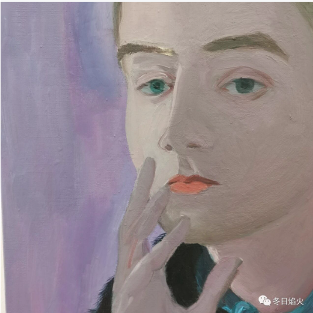

- 关注社会，建立和这个世界更多的联系。

何新说，来踩踏我吧。所以我来了。

何新其人，具有国士之风，但是年纪大了就开始犯糊涂了，开始讲什么梅森会，欧洲的历史是虚构的，云云。但是他年轻时候说的一些话，发表的一些看法，我认为是有价值的。他年轻时候欣赏的两句话，推倒一世之智勇，开拓万古之心胸。从他正面硬刚国务院总理朱总理的国策，我就明显感受到，那推倒一世之智勇。他说，

我愿以言邀罪，成为千古罪人。

在二十年前，他在给朱总理的信里面这样写道：

      我认为正是由于您主持下的一系列政策失误：如解散国企，如"下岗分流、减员增效"，
医疗市场化，住房产业化，教育市场化
，金融外资化等，导致了当前严重的社会问题；并且给下一任领导人留下了沉重的包袱。
　　对于您个人的崇颂之声，近年在海内外传媒上，您听到的应已很多。但作为全国政协委员，我认为自己有必要本"知无不言、言无不尽"的原则坦陈我个人的以上一些不同意见。
　　毁誉无常，历史则是客观存在。政治家总是要对历史负责的!我真希望形势并非如我所言那样消极，而我的上述看法都是极端荒谬错误的。那将是国家之大幸!人民之大幸!而我个人则情愿以言邀罪，成为千古罪人。
　　又及：我窃以为，您的公子如大有为，似可委之为中国石化或中国证券的领导，可在国内领取高薪。所谓内举不避亲。但作为国家首相之子，似不宜作为外国在华区域的利益代理人，尤不宜担任美国巨型跨国公司（如高盛财团）享持高薪的在华督办或业务主管。这是会招致物议和令人想入非非的。此或会有损您持政"清廉"的政声和清望。　　诚惶诚恐，不知所云。敬颂
　　政祺!
　　何 新

医疗市场化，住房产业化，教育市场化，在二十年后，变成了压在人民身上的新三座大山。1996年12月，时任宿迁市副市长被派到辖下的沭阳县兼任县委书记，他大拆大建，卖医院卖学校。因为财政没钱，他要求每个财政供养人员扣除工资总额10%，每个农民出8个义务工，组成修路队，在高峰时，扣款达到20%，甚至离退休人员的工资，也被扣除10%用作交通建设。根据媒体报道，他曾说过一句话让全国哗然：“宿迁515万人民所居住的8555平方公里的土地上，只要可以变现的资源或资产，都可以进入市场交易”。337家幼儿园，122家乡镇卫生院，相继变为民营，11家县以上医院已有9家完成改制。宿迁市泗洪县幼儿园的老师们，在市委门前静坐示威：“不按中央文件将出售的幼儿园收回公办，就罢课。”这些老师们为不连累吃财政饭的丈夫们，已经写好了离婚起诉书，准备“集体离婚”。沭阳县中医院在改制时，数百位职工用大铁锁，将门诊部大楼锁了3天，“不答应改回公办，就到北京去上访。”后来，由于反对声强烈，教育的市场化放慢了步伐，但是医改，宿迁市没有回头。根据调查显示，改制后，全市医院门诊费由原来的52.84元降到现在的26.54元，住院费用由原来的581.78降到477.68元。仇和说，
我不办穷人医院，穷人学校。政府包办的后果，事实上穷人受损，富人得利，官僚得利，这种情况，其实只有让市场来发挥功能，政府的作用应该是直接给穷人发补贴。
这其实和何新说的新国家主义经济观不谋而合。创造财富，
资本只有人格化，才有动力
。但是分配财富，却是另外一回事。宿迁市135家医院都被卖了出去，宿迁成为全国唯一没有公立医院的地级市。卫生部调查组曾批评卫生局长：“你还是不是一个卫生局长。”

从此，宿迁民营医院的院长们最头疼的事情就是两个字“创收”。国家财政不再补贴，医院却需要大量的资金来维持运转，钱从哪里来，那就只能从老百姓身上来。但是看病和去超市购物是两回事，超市里面的货物贵，我可以不买，我可以选择便宜的。但是医生说，你需要做手术或者吃药，你却没有底气反驳，只能默默接受昂贵的价格。这里就导致了紧张的医患关系，纵观世界上其他国家，没有一个国家说医院完全是私营的，公立医院还是占据了主体地位。

但是宿迁市2011年重新筹建公立医院却还有别的考量，国家意识到医疗领域的特殊性，开始对公立医院进行补贴。而宿迁市因为没有一家公立医院，错过好几个小目标。根据
江苏省卫计委2011-2013年苏北五市统计数据，三年各级财政对宿迁市医疗卫生机构共投入资金3.85亿元，仅占苏北其他四市投入平均数27.34亿元的14.08%
。政府筹划向上市公司金陵药业买回当年7000万的宿迁医院，报价超过10亿，而后遭到拒绝，后来又重新花了20亿再建一座新的医院。而对此，卫生局长回应称，以前是总量问题，供给不足，现在是质量问题，建立公立医院是从看得上医生到看的上好医生。

教育市场化也被批评得一塌糊涂，市场化造成教育失衡，失公。在《关于我国高等教育公平问题的研究报告》中，作者评价，教育的基本功能之一，就是缩小贫富差距，促进社会平等。如果教育反而扩大社会差距，那岂不是背离了初衷。西方经验实行容易，见效难，因为西方体制背后的深层结构，
学术自主
，教育私立，市场机制，中国无一具备。教育不平等扩大阶层鸿沟，无疑使贫民子女升学门槛大为提高，向上流动的障碍增大了。上大学，现在不但要比较智力和勤奋，还要比较身份，户口，关系网和财力。教育市场化还引发了大学社会化，众多大一，大二的大学生，已经像大三，大四的大学生一样，早早地参与进社会活动里面，学生们收获的是大学的名气，而不是道德知识，技能知识等。我个人这里有一点自己的想法，教育对不同的人意义是不一样的，有的家庭需要挣钱维持生活，有的家庭富裕，这样的家庭的孩子可以多多培养一些家国情怀。公平不是一模一样，鼓励差异化发展，尊重每一个职业。伴随着资本的扩张，大学扩招，今年有1067万大学生毕业。

1998年的房改工作犹如城市化浪潮里一道不可忽视的大浪花。20年前利用公众住宅解决居民住宅问题，20年后用市场化解决居民住宅问题。1998年，朱总理，他在记者会上又一次明确表明立场，住房建设必然成为中国新的经济增长点，中央将在下半年出台住房新政策，停止福利分房工作，推行住房商品化。他说：
“
无论前路是地雷阵，又或者万丈深渊，我都将一往无前，义无反顾地向前冲，鞠躬尽瘁、死而后已，也不后悔
。”后面的事情，我就不多说了，现在的年轻人大家都有切身的体会。

房地产和教育，这两者如今又被捆绑在一起，叫做学区房
。

回过头来再看，何新的话无异于敲响了警钟，预言了未来二十年的事情。那他还说了什么呢，20世纪的现代资本主义和19世纪前的古典资本主义具有一个重大的不同点，现代发达国家社会制度中都具有一个成熟而高度完善的社会保障体系。这一体系为社会中的正式公民提供了生老病死以及失业的最低生活保障，正是这个体系才保证了一个占有社会人口多数的所谓中产阶级的稳定存在。
西方的政治民主制度正是建立在这一社会保障体系之上，所以无论发生怎样的政策争论和政府更迭，党派政见分歧，由于对社会多数民众基本生存利益损害不大，所以社会的根本基础不会动摇。中国左右两翼的理论家都对当代资本主义缺乏全面和正确的研究和了解。

何新说，中国几千年的全部历史经验均表明，大量失业人口，无业人口的涌现，从来就是一个制度失败的表征，同时也是导致天下大乱，社会分崩离析的根源。

因此，从社会后果来说，我们当然有理由怀疑向中国灌输私有化理论者的动机。这里张五常教授就是上了何新的讨伐名单了，张五常被认为是美帝派过来的碟中谍了。

2026年 Gemini pro的总结
它提醒我们，**任何改革都有代价**。过去三十年，中国通过市场化获得了惊人的经济增长（效率的胜利），但何新所担忧的“社会分崩离析的根源”（公平的缺失和保障的不足）也逐渐显现。

现在的中国，正处于一个从“效率优先”向“兼顾公平”甚至“公平优先”转型的痛苦磨合期。重建公立医院、整顿教培行业、强调“房住不炒”，某种程度上都是在**往回补课**，试图重新找回何新当年所强调的那个平衡点。

**何新的预言之所以应验，是因为中国在90年代为了追求极致的“效率”，服用了一剂新自由主义的猛药，治好了“贫血”（经济落后），却留下了“高血压”（贫富分化和民生焦虑）。**

**为什么现在要打压学区房？** 因为教育变成了资本游戏，这就切断了底层上升的通道（违反了公共品原则）。

**为什么宿迁后来要花大价钱重建公立医院？** 因为政府发现，省下来的钱，最后都要花在维稳和处理社会矛盾上，而且代价更大。

温铁军最著名的理论是：**中国每一次躲过经济危机，都是因为把危机转嫁给了农村。**

**何新看到的是**： 盲目私有化会摧毁社会稳定的根基（国企工人失业、保障体系瓦解）。

**温铁军看到的是**： 这一次，农村这块海绵快吸满了，吸不动了。于是，国家必须寻找新的载体来吸纳海量的超发货币和过剩产能。

**何新（政治视角）**： 警告我们，完全的市场化会抽掉社会的底板（社会保障），作为个体，我们要警惕被资本逻辑彻底吞噬，呼唤国家的兜底责任。

**温铁军（经济视角）**： 告诉我们，繁荣的背后总有代价（农村的牺牲、年轻人的内卷），我们要看清历史的周期，不要盲目自责，以为都是自己不够努力。

**项飙（社会视角）**： 建议我们，在系统还在调整、宏大叙事难以改变的时候，**我们可以通过“重建附近”，在自己身边构建一个小小的、温暖的、有人情味的避风港。**