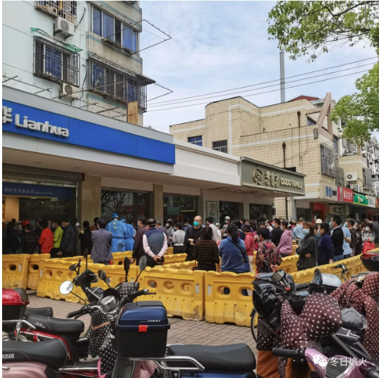
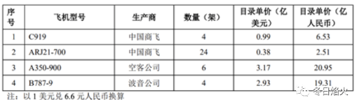

- 一些感想

好久不用手机码字了，最近一直在回顾过去的历史，关于经济改革的问题，教育，医疗，房产的市场化。在我还在觉得公有制有它的道理的时候，去了一趟超市，我又觉得资本人格化的好处了。
 
最近上海一直处于封控状态，红绿灯在闪烁，但是十字街头没有等待的车辆，略显萧条。11点钟的时候，我拿着出入通行证出门了，莲花超市的门口有好几道围栏，却没有人排队。我过去询问，莲花超市门口身穿防护服的人员和我说，休息了，下午一点开门。我有点困惑，超市中午休息在夜里十点还有外卖的城市有点不可思议。以前打零工的时候，顾客就是上帝，机器不停人不停。现在中午，超市关门休息两个小时，堪比德国超市的人文关怀，要是鼓励大家周日再集体休息一天就更好了。就在我安慰自己买不到算了的时候，我发现旁边的水果超市还开着，滚圆滚圆的西瓜看起来格外诱人。我想，那就买些水果吧。我向水果店的工作人员问起隔壁的超市咋回事，他说，志愿者要休息。这个回答有点意外，但是透露了一个额外的信息，现在超市的工作人员不是正式员工，是义务工作者。我在想，那正式员工去哪里了呢，像我一样在四处寻找生活的物资吗？
 
隔壁水果店的选择还是很丰富的，红红的大苹果，可爱的人参果，还有开了豁口配了吸管的椰子。后来我又去包子店，老板是个实在的小伙，一边忙着手上的活，一边和我说店里还剩啥，让我自己挑，我买了点蛋黄鲜肉粽，价格也公道，6.5元一个粽子，一包五个，32.5元。然而我还是想去超市看看有没有更多的选择，门口的志愿者还让我给他带包烟，并且建议我不要回去了，先去排队。因为上午的时候，队伍的长龙弯弯曲曲一直排到了百米开外的紫燕百味鸡。我再次询问起中午为什么休息，得到的是另一个回答，消杀。我问为什么晚上不做，上午都那么多人流量，要有问题早有问题了。对方说，流程总归要走的。
 
于是乎，大量的需求被挤压，不到十二点，莲花超市门口就开始排队，以老年人和中年人为主力军，大有抢购的风潮。这么多人在这里排队超过一个小时，这在时间就是金钱的上海，是一件不可思议的事情。另外这个现象还有一个更让人奇怪的点，物资其实是充足的，却有一种没有足够物资的担忧。我长这么大，第一次在国际化大都市上海切身感受到了。
 
就在我码字的时候，有个老板娘运了一车西瓜来卖，她的西瓜又大又圆，在如今普遍涨价的情况下，她只要五元一斤，但是要求一大框起卖。老板娘在她的电动车上压了很多西瓜准备运走，旁边人打趣道：小心，砰地一声，西瓜炸了。老板娘说，之前也有个小伙子老是这样说，不知道为什么。旁边人解释道，西瓜炸了，我们就有的吃了。老板娘说，你们直接点，想吃就说出来。我在这些承包商以及之前包子店老板身上感受到一种活力，这种活力是一种真实的挣钱的快乐。虽然做生意很难，但是资本人格化之后，他们的主观能动性被无限激发出来了。虽然市场不景气，但是他们依旧乐观面对这一切。这是一种非常可贵的精神。我在排了一个小时队之后回到小区，看见老板娘在卖瓜，秤就摆在旁边，似乎没啥人。老板娘说承包了二十亩地，就靠卖西瓜吃饭了。说实话，我一点也没有感觉到资本的罪恶，还是我没有马克思想的深远。
 
最后我感慨，中国私有制经济生存空间有限，或者说中国的发展，缺少了一个资本发展壮大的阶段。在一个经济水平和学术研究落后于西方的情况下，谈民主和自由有点好高骛远。

另外我还想立一个flag，昨天看到C919试飞成功，但是仔细一看适航证还没有拿到手。我觉得2022年拿不到的。虽然之前新闻发布说争取2021年拿到，时间放宽并不能改变没有拿到的现实。尤其在如今整个航空业不景气，俄罗斯航空暂停了所有国际航班，整个航空业的发展都遭遇了寒冬。就在不久前，巨无霸般的海南航空破产重组更是暗示了平静海面下的暗流涌动。中国东航发布了本次募资购买飞机的价格表：

从中依旧可以看出，空客与波音依旧是大头。破冰之路依旧困难重重。

2026年 Gemini pro的回答:
**普通商品（非公共品）领域，市场机制依然是最高效、最有人情味的。因为它把“利己”和“利他”通过交易完美结合了。我们怀念烟火气，其实就是怀念这种“未经行政规训的生命力”。**

“夹缝中的活力”： 你看到的包子店老板和西瓜老板娘，是**中国最坚韧的底层商业力量**。他们不需要国家补贴，只要给一点点缝隙（允许开门），他们就能野蛮生长，并喂饱这座城市。

**关于 Flag**： C919 实际上在 2022年9月29日 惊险地拿到了中国民航局的型号合格证（TC），并在当年12月交付了首架给东航。所以从结果看，你的 Flag 倒了一半（证拿到了），但从实质看，你的判断是对的——**大规模商用确实没那么快**。直到2023年5月它才完成首次商业载客飞行。

**仅仅有国家的意志（造飞机）是不够的，最终必须经受市场（航空公司盈亏）的检验。**

**上海封控的经历，其实是给你上了一堂生动的“边界课”**： 当公权力越过了边界，去管它不擅长的细枝末节（如规定超市几点开门、如何卖瓜）时，社会就会失去活力，甚至制造匮乏。