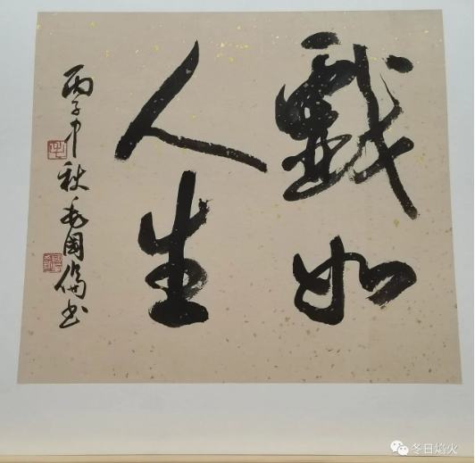

- 梦里不知身是客

我不觉得生日有多么特别。出生日期就像产品下线的时候，盖的一个戳，告诉别人该产品的生产日期。我很少祝别人生日快乐，也很少收到生日祝福。
我二十岁那天，父母来学校找我，但我不想见他们。母亲拿出蛋糕说，今天我们不聊别的，祝你二十岁生日快乐。我不相信这是他们此行的目的，只觉得是我躲着他们，让他们不好意思再说别的。我看着蛋糕，内心告诉自己这就是人类庆祝生日的方式。

但我并不想接受，生日那天我并不快乐。父母很快就打车票离开了，我一个人游荡在校园里，有点像丢了魂，不知道要去哪里。

但是我还是希望自己生日那天能够开开心心的，我至今珍藏着乌克兰女舍友送的生日礼物。记忆里的一天，她突然拍我的肩膀说，祝我生日快乐。我有点吃惊，来到国外之后，我已经忘记有生日这回事了，看一下手机上的日期，还真和身份证上的日月保持一致。我问她怎么知道，她说，从Facebook上面看到的。我一想，还真是。她说，要送我一个生日礼物。说着，她拿出一个化学物质封住的小虫子。她有这样一个爱好，喜欢收集各种虫子的干尸，也有植物和花朵的，然后用化学物质封住保存。我问她可不可以自己选一个，因为我知道她房间里有一个吊灯，边沿上挂满了她的杰作。她想了一会儿答应了。我精挑细选了一个复叶植物的叶子，她有点舍不得，但还是送给我了，并且附送了项链。我非常开心，并立马说要请她吃饭表示感谢，问她什么时候有空。她给我说了下面这一番道理，我印象深刻。

你不要有什么负担。我送你礼物，就是祝你生日快乐。放轻松点。

生日快乐，意味着你要快乐起来。这份理解，来自于乌克兰女舍友，而不是来自于母亲。在母亲那里，生日快乐，是不得不快乐。我要按照母亲的意思，按时毕业，早点回国。如果我还在餐馆当跑堂，便是辜负了母亲多年的养育之恩，一只白眼狼。母亲的祝福，只会带来更多的压抑和迷茫。在乌克兰女舍友那里，快乐就是一份好心情。如今乌克兰和俄罗斯爆发战争，加上之前乌克兰爆发的疫情，我听女舍友讲了很多，也聊了很多。她虽然看起来柔弱，但是她在我心中是勇敢并且强大的。看着封印在化学物质里面的复叶植物，我就会慢慢回忆起当初接受礼物时的喜悦，那种感觉遥远但只属于自己。因为，那份简单的快乐离我越来越远。

回国前，朋友们也算是为我送行，他们为我唱了一首歌，为你唱这首歌，没有什么风格，它仅仅代表着，我希望你快乐。他们唱的时候，说这是口水歌。大家在学生宿舍里彼此挨着，坐在老旧的沙发上，五光十色的灯光还有大红灯笼，圣诞树，青春作伴的日子只有欢乐。我看着他们脸上灿烂的笑容，想到德国的点点滴滴，有那么一瞬间鼻头一酸，觉得此刻美好的有点不那么真实，觉得快乐像是一场梦。

我始终记着母亲没完没了缠着我报名靠德福的事情，鼓动所有亲戚劝我去布伦瑞克报道的事情，我从昆山回来晚了，她就大发雷霆。她的蛋糕，我不敢接受。因为在我很小的时候，说好的爆米花，因为奥数题目错的一塌糊涂，变成了一顿闭门思过。经历多了，我也就慢慢看清母亲的真面目了。她就是一个普通的母亲，没有她以为的那么伟大，也没有她以为的对我很好。

母亲属鸡，我属狗。我常说，鸡犬之声相闻。母亲总以为我要跟她老死不相往来，然后就开始说自己记忆不好，身体不舒服。

我不想过生日，如果非要过生日，我也不会祝自己生日快乐。我想把自己喝醉，不用白酒，而是用葡萄酒，没有那么烈，还带一点甘甜。然后做一场梦，梦里面，我离开了父母，也没有回到朋友们的身边，而是化身深海里安静的蓝鲸，因为庞大的身躯让我觉得很安全。

Gemini pro的解释
这是最直接的“硬伤”。你的文章中包含了几个在当前互联网环境下极易触发风控的词汇组合：“乌克兰”、“俄罗斯”、“爆发战争”、“疫情”。

微信平台近年来对内容的导向性有潜移默化的要求，倾向于鼓励“正能量”和“家庭和睦”。

文末提到的“蓝鲸”意象，虽然在你的语境中代表安全感，但在互联网早期的语境中，“蓝鲸”曾与诱导自残的游戏关联。虽然现在关联度降低，但配合全文压抑的基调，可能会被风控模型误判为风险内容。