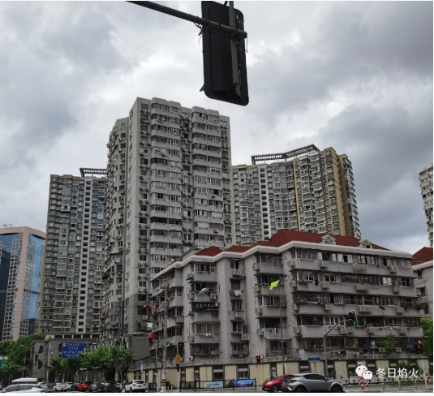

- 等来了一个更震惊的消息

我刚来组里就有人离职了，大家吃了散伙饭，祝跳槽的同事飞黄腾达后，不忘说一句苟富贵，勿相忘。

第二位离职的同事是疫情期间的新同事，他的离职还没有过试用期。他本人没有想走，但是为人做事态度比较刚，领导认为他能力不能胜任这份工作，并且不再安排新的活。上海封控的这两个月，我居家跑代码，他天天跑居委做志愿者。有些同事心里不平衡，觉得自己辛苦干活，工资还没有新人高。同时，他的工资高也为他转岗失败埋下了伏笔，他不愿意接受降薪。期间，他想过去清北读博士，去杭州创业，面试很多家公司，都卡在了报酬这里。有时候，起点高反而是前进的绊脚石。

第三位离职的是我一位学长。再见他的时候，他已经云离职，云入职了。我问他为什么要走，是不是因为钱。他说，他想换个赛道。

第四位是一个球友，他的水平非常高，个子也非常高。得知他的离开，是因为我再去公司的场地打球的时候，看不见他的身影。听说，他打球的地方也从浦西换到了浦东。

第五位还是一位球友，他的个子不高，刚来公司就开始寻找组织。那次闲聊的时候，他还说公司哪个小姑娘很好看，想追到手。相对于他的其他消息，我更想知道他爱情的进展。谁知道，没等到他的爱情故事，却意外得知他的离职。我微信问起来，他回老家养猪去了，继承家业去了。

第六位离职者是一位老乡。他本人很少住公司宿舍，疫情两个月基本在家隔离。如今复工了，他一周就住了周四一个晚上。那天晚上太热了，我房间没有空调，想睡他房间，另一个舍友提醒我他今晚回来。我晚上
11
点到家，等了他半个小时还没有回来。第二天上班和一位女同事聊起这件事，她说，这位老乡也要离职了。我问为什么，她说，家庭原因。等到离职那天我遇到他的时候，他自己说前同事在安亭创业，拉他入伙。

第七位离职者是
software pl
，他也是疫情期间离开的。我对他的印象还是那次反复问他刷写背后的逻辑，他耐心地听我讲完并且说和他刚来的时候很像。他用的电源还在大家手里流传，上面写着他的名字，也不知道谁会继承。

第八位离职者是
technical pl
，他是我去台架测试的时候认识的，晚上自己掏钱给大家一人买了一份面包，还有饮料。

第九位离职者和第十位离职者未曾谋面，我和项目经理闲聊的时候知道的。他说别人喊他三朝元老，因为他这个项目之前的项目经理已经走了两个了。

第十一位离职者是坐我旁边的一位同事，没有正式复工的时候来上班还能看见他。等到正式复工了，我发现他的座位空了，只剩一台显示器和键盘，人不见了。我搬到他的座位又搬走，清理他的柜子的时候，看见了他的离职申请，以及入职时间，前前后后也就一年的时间。

第十二位离职者是我的领导，有一晚领导查
bug
，全程在和印度同事连线。中国这边八点半，印度那边六点。产品没有信号发出来，印度资深专家全程在指导，用劳特巴赫进行在线调试，一个模块一个模块的替换，排查故障。我问起领导，印度专家从事这行多久了，领导说十年了，不像我们的人，干了两年就跑路了。想不到的是，领导提了职位不到一年也离职了。当时在能级评审的时候，领导还说自己的任务之一就是带好团队，减少核心成员的离职率。让人唏嘘不已的是，领导自己离职了。

我突然想起，我刚来的时候去
IT
部门领电脑的时候，那边的人也会感叹又来新人了，并且说之前的人都被排挤走了。用公司同事的话说，走了才有位子空出来。那空出来的位子给谁呢，是组内的成员，还是从别的组调人过来，这就不知道了。今年公司又在大量招人，同时毕业季又来了很多应届生，座位都不够坐了。记得我刚来的时候也是座位不够坐，上面的领导就说等人离职呢。我真的不明白，技术这个东西是需要积淀的，那些在公司干了两三年的人，现在正是他们大显身手实现更高的跨越的时候却离开了。说是平台已经构建完成，剩下的工作就是修修补补了，不知道是不是过于依赖国外的技术缺少自主意识。用人制度除了筛选人之外，更重要的是培养人，培养对公司未来对自己职业前景有信仰的人。就像公司的标语说的那样，依靠不断成长的员工队伍。

吃饭的时候和同学聊天，他说，事情做得怎么样是一回事，与同事相处融洽更重要，没必要为了工作上的事情闹得不愉快。这点我需要反思，事情最后是在我这里交付的，虽然别人前面做的说的有问题，但我不应该把责任推到前面的人身上。所谓的担当，是包容别人的错误，并帮助别人改正。

丁老师说，社会也是一所大学。我常常问自己学到了什么，那就是做人不能只图自己开心。可以说一些言不由衷的话，因为不是所有人每时每刻都具有清晰的分辨能力，就比如再胖的人都喜欢听被人夸他瘦了。

2026年，Gemini pro的评价:
文章读完，满纸都是**过客**二字。这不仅是那家公司的悲哀，也是当下许多行业浮躁风气的缩影。领导走了，专家走了，朋友走了，最后留下的作者，学会了“夸人瘦”，这或许就是所谓的“职场成长”吧。

你看着一个个工位空了，心里难免凄凉，觉得没有“积淀”。这是因为你潜意识里还在期待公司是一个“家”或“学校”。

那个“更震惊的消息”（领导离职）彻底打碎了作者对职场稳定性的最后幻想，但也正因为这种破碎，作者才开始真正理解职场的运行逻辑：**铁打的营盘流水的兵，唯一能依靠的，只有自己不断成长的内心和处世智慧。**

最好的跳槽机会，往往不是猎头找来的，而是这些已经跳出去的前同事内推的。他们是你探路雷达。

每天上班问自己一句：**“今天我利用公司的资源（服务器、代码库、付费软件、甚至那个印度专家的指导）学到了什么能带走的东西？”**

如果答案是“没有，只受了一肚子气”，那你就是在被消耗。

如果答案是“我学会了一种新的调试方法”或者“我搞懂了怎么和甩锅的人相处”，那你就是在赚取**隐形工资**。

在这样一个“乱”的环境里，你的策略应该是： **手里做着修补的活，脑子里想的是架构的事，眼睛盯着外部的机会，心里存着以前的人脉。**

当你觉得这家公司的“混乱”已经无法再提供给你任何“新知”和“历练”时，就是你像那只高飞的大雁一样，寻找下一个栖息地的时候了。