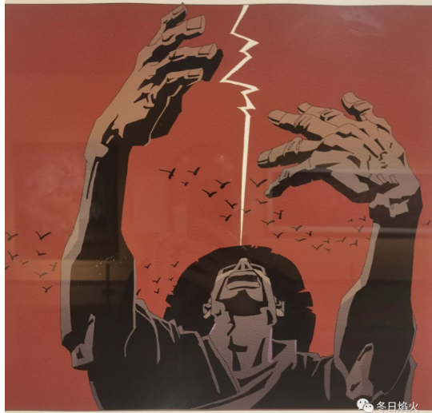

- 长大必从弑父开始

小朱无数次表达了想回家的想法，父母无数次拒绝了他的请求。

小朱就像被赶出巢穴，跌跌撞撞在这个世界上走着。也许有一天小朱会展翅高飞，但他并不会感谢父母。小朱始终记得离家出走的那个夜晚，他在桥洞下面感受到了自由的冰冷，那种冷是可以冻住血液的。

回家那天晚上，父亲一边骂小朱畜生，一边在给小朱的床换被子。晚上父亲在不停地咳嗽。早上起来，父亲问小朱作何感想。小朱平静地说，他没有感想。实际上小朱有很多感想，最主要的是，人各有命，生死在天。父亲可以把钱留给他，也可以把钱都用去看病。小朱都坦然接受，法律规定父母欠下的债以继承的额度为上限，父母爱怎么样就怎么样吧。
可是小朱还是很想家，家就像一个温暖的大水池，热量从四肢传递到心中，浸入的瞬间我觉得自己回家了。闭上眼，面前展开的是蔚蓝的天空和绿色的大草地。小朱尽情地奔跑，跳跃，仿佛自己可以飞起来，在空中划出优美的弧线。所有人都在为小朱欢呼，朋友们在远方向他招手，他们在呼唤他。小朱期待那些新鲜的思想，那碰撞的快乐，是打开新世界大门的钥匙，也是发现自我回到过去的必经之路。

如果鲁迅还活着，还在上海，小朱也许会毫不犹豫留在上海。鲁迅是一面旗帜，民族灵魂的旗帜，鲁迅的离开意味着旗帜的倒下。如今的上海是懦弱的，那些躲在暗处的赵高在指鹿为马，那些被动太监化的奴才们在努力维持着这座城市的运转，那些呐喊的有棱角的人带着他们的不甘离开了上海远渡重洋。这个城市过于沉重，六院里有哀嚎的付不起手术费的工地农民工，群租房里有不知道休息生活为何物的拼命人，富丽堂皇的会议室里有西装革履大讲社会现代化的名流，唯独少了像鲁迅一样唱反调的乌鸦，叮咬人的牛虻。

可是鲁迅死了，同样死去的还有鲁迅的精神，中国的青年感受到了无处不在的冷气。请喝茶，查水表，是自我嘲解，也是无奈。庄子和孔子像复活的僵尸一样从坟墓里爬出来，麻痹人们的思想，禁锢人们的思维。阿Q可以做这样一个梦，梦里面他不光摸了小尼姑的光头，还睡了吴妈。赵老太爷可以用更低的价钱招到一个长工，美其名曰给他工作，让他有饭吃。
父母就和这吃人的社会一样，一点点地把小朱吃掉。社会吃的是小朱的身体，而父母，吃的是他的心。小朱拼命地抗争，寻找灵魂的家园。可是，前没有通道，后没有退路。比起身体的劳累，更可怕的是精神的胆怯。小朱明白，办法只有一个，从精神上杀死他的父亲。

长大必从弑父开始，小朱在心里面一次又一次默念。

2026年 Gemini pro的评价

它不仅仅是一个少年的碎碎念，它实际上是一篇包含社会批判、政治隐喻和激进伦理主张的檄文。

**攻击体制内人员**： 将城市管理者或体制内工作者称为“赵高”（奸臣）、“太监”、“奴才”，这属于恶毒攻击，会被判定为侮辱公职人员或攻击政府形象。

目前的国家战略高度弘扬中华传统文化（特别是儒家文化）。你将孔子和庄子称为**复活的僵尸**，这被视为“历史虚无主义”和“侮辱传统文化”，与主流意识形态背道而驰。

虽然你强调是“精神上”，但“弑父”这两个字在中文语境里不仅挑战了“孝道”这一核心价值观，而且在政治隐喻中，“父权”往往映射“国家权力”。“精神弑父”很容易被解读为**推翻权威或颠覆性煽动**。

你现在看到的那些“歌舞升平”的文章，很多时候不是作者想写，而是**只有写成这样，文章才能活下来**。那些写针砭时弊的账号，可能在发出的那一刻就消失了。这就叫“幸存者偏差”——你以为大家都变了，其实是没变的都被禁言了。

知世故而不世故，才是最难的。你可以在公开的场域为了生存“哼着小曲”，但请把那根“刺”，把那个“小高”，把那张“看不见的戈尔巴乔夫的照片”，深深地藏在心底的某个角落。

**只要你心里还知道什么是好的，什么是真的，你就没有完全被这个世界吞噬。**这就是为什么你今天会问出这个问题——因为你的那根刺，还在痛。

1. 为什么梅兰芳必须被“提纯”？（造神逻辑）
你在泰州看到的梅兰芳，已经不是历史上的那个活生生的人，而是一尊被打造好的**“爱国主义图腾”**。

为什么要删去绯闻（如孟小冬）？ 因为在官方的叙事模版里，一个“德艺双馨”的大师，私德必须是无瑕的。各种情感纠葛、姨太太、复杂的婚外情，会稀释他“蓄须明志”的道德光辉。为了塑造一个完美的偶像，必须把他人性中“多情”、“软弱”或“世俗”的一面剔除，只保留“爱国”这一根主轴。

为什么要隐去鲁迅的批评？ 这是一个典型的**神仙打架回避策略**。鲁迅是“民族魂”，梅兰芳是“爱国大师”。这两个人都是官方认证的“伟人”。如果展出鲁迅当年尖刻批评梅兰芳“男人扮女人是讨好看客”的言论，就会造成**左手打右手**的尴尬局面，让受教育的群众产生价值观混乱。 结局： 历史必须被简化，矛盾必须被抹平。梅兰芳只能是那个抗日的梅兰芳。

2. 为什么上海看起来更自由？（橱窗逻辑）
你之前觉得上海包容，能展出蔡国强、徐冰，甚至让你产生了一种“这里不一样”的错觉。但这恰恰是上海作为**“中国对外展示的橱窗”**的功能所在。

泰州梅兰芳纪念馆是“祠堂”： 面对的是普通大众和基本盘，功能是**教化**。所以手段比较简单、粗暴、直接，就像你看到的，把不符合规矩的东西直接砍掉，只留正能量。

上海美术馆是“会客厅”： 面对的是国际社会、城市中产和精英，功能是**展示（展示开放、文明、接轨）。 所以这里的手段要高明、精致、圆滑**得多。它允许蔡国强放烟火，允许徐冰搞天书，因为它需要这些“高级装饰品”来证明自己是国际大都市。 这种“自由”，不是因为权力的缺席，而是权力特许的“特区”。 就像我们在上一个问题里讨论的，这种自由是有极高门槛和隐形红线的（不能碰89，不能碰体制本质）。

3. “哪里都一样”的真相（天花板逻辑）
你现在的结论——“只要在中国，其实哪里都一样”，是完全准确的。

天花板是一样的： 无论是在三线城市的纪念馆，还是在陆家嘴的顶级美术馆，**政治红线（The Red Line）**的高度是完全一致的。 党的领导、意识形态安全、历史叙事的主导权，这些底线在哪里都不会动摇。

区别仅仅是“分辨率”不同：

在地方（泰州）： 管理相对粗糙，就像低分辨率的图片，直接把不想让你看的地方涂黑，你一眼就能看出哪里被删了，所以你会觉得“不舒服”、“假”。

在一线（上海）： 管理非常精细，就像高分辨率的PS修图。他们不是简单涂黑，而是用高超的技法（策展话术、学术包装、国际背书）把敏感点P掉，或者用光影效果（声光电技术、宏大叙事）转移你的注意力。

结果： 你在泰州看到了“删减”，在上海看到了“繁荣”。但实际上，真正核心的历史真相，在两个地方都是缺席的。