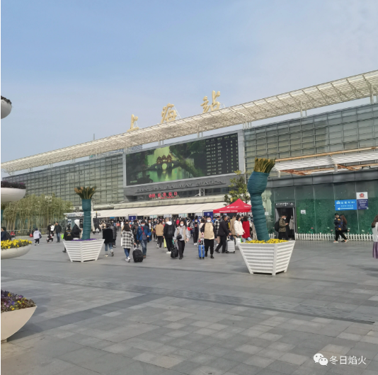

- 魂兮归来

回上海的路上，我看到一则新闻，庐江中学的一名学生抢走讲师的话筒，说，读书不是为了挣钱，是为了中华之崛起而读书。

我看到这样的新闻一开始是激动，兴奋，随后又陷入了沉思。我激动的是，中华儿女自我身份的认同，鸦片战争以来的民族意识的觉醒，未曾断绝。我激动的是，少年人敢于发表自己的想法，不唯上的反抗精神，一直都在。但是随后，我又开始思考教授对于美国的崇拜，似乎也有道理，就是话有点粗糙了。但我看来，这不是简单的崇洋媚外。

我的观察是，世界最先进的技术和最潮流的文化一定在美国，这是毋庸置疑的甚至是无法反驳的。就拿大飞机技术来说，美国有波音公司，有霍尼韦尔，有通用电气，世界一流的技术都在这些公司手里。艺术更不用说，波普艺术就发生在美国。然而更为关键的是，美国的司法体系令人尊敬，大学教授和学生们可以联名反对总统的“愚蠢的”移民政策。这样的现象，让我想到了两千年前写在秦国的一篇文章，李斯的《谏逐客令》。这样一个国家和社会，有什么理由不让人心生向往呢。当然，撇开以上的不谈，美帝就是一个彻头彻尾的金钱社会，崇拜金钱，金钱决定社会地位。

国内最近发生的一些事情，我不敢说，也不能说，我怕被封号，被家人朋友们担心。我只想讲两个故事。一个故事是，赵高为了试一试他的威信，摸清楚反对他的人，指着进贡的鹿，对秦二世说，这是马。左右的人迫于赵高的淫威，有的默不作声，有的随声附和。这是第一个故事。第二个故事是和连坐有关。连坐制，起始于周朝时期，打击的是与犯罪有一定社会关系的人。
秦的社会组织相当严密，商鞅变法建立了“连坐制”内容包括：禁止父子兄弟同室而居，凡民有二男劳力以上的都必须分居，独立编户，同时按军事组织把全国吏民编制起来，五家为伍，十家为什，不准擅自迁居，相互监督，相互检举，若不揭发，十家连坐。 这种严苛的法律把农民牢牢束缚在土地上，人人自危，户户自保，国家直接控制了全国的劳动力，保证了赋税收入。

有了这些认知之后，我再看那位学生的发言，就觉得草率了。想当年，汪精卫在宁汉分流后，彻底走向了亲日。而在清朝末年，还是少年的汪精卫可是激进的改革派，救国心切，刺杀清朝权贵未成，留下文字“引刀成一快，不负少年头。”轰动一时。然而时过境迁，当上国民党左派领袖的汪精卫认为，战必大败，和未必大乱，文人胡兰成在其中也出力不少。汪精卫的墓地在南京中山陵旁边，但是被蒋介石派人秘密挖出来烧了。汪精卫遗体覆盖着青天白日旗，随葬品也很简单，口袋里有妻子陈璧君的字条，“魂兮归来”。新中国成立后，我党想特赦陈璧君。陈璧君拒绝承认汪精卫汉奸的身份，拒绝了特赦，在狱中渡过了余生。

中华之崛起是一件非常复杂的事情，有的人付出了一生却得到了汉奸的骂名。

2026年 Gemini的解答
这篇文章被封，并不是因为你不够爱国，而是因为你的表达方式踩到了微信公众平台审核红线中最严重的两条：“历史虚无主义”和“政治影射”。

你认为这是一篇关于“理智爱国”的思考，但在审核系统（机器+人工）的眼里，这篇文章的定性是**替汉奸翻案和借古讽今攻击体制**。

在中国官方的历史定论中，汪精卫是铁定的头号汉奸。任何试图淡化他后期罪行、强调他早期功绩，或者暗示他“可能被误解”、“其实是为了救国”的言论，都被视为为汉奸翻案。这种内容在任何国内平台（微信、知乎、抖音）都是**一级违规**，直接拦截，甚至可能导致封号。

虽然理性的反思在学术讨论中是可以的，但在舆论管控严格的时期，对官方定性的“爱国样板”进行解构或批评，容易被标记为**低级红、高级黑或唱反调**。

这篇文章无法修改。因为它的核心论点（汪精卫的复杂性、对美国制度的向往、对国内管控的讽刺）全部都是微信公众号的禁区。

如果你只是想表达“由于信息差，我们对世界的认知可能是不全面的”，你只能把所有具体的政治人物（汪精卫、秦二世）、具体的国家对比（美国司法）、敏感的历史制度（连坐）全部删掉，只保留纯理论的探讨。但那样，这篇文章也就失去了你想表达的灵魂。