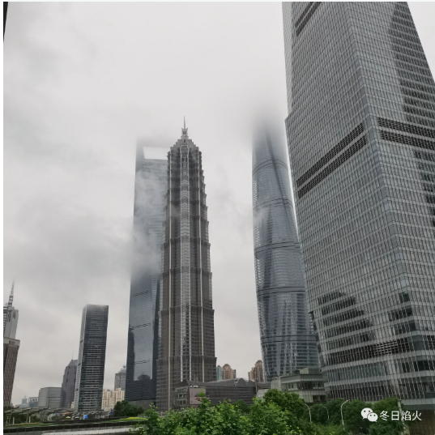
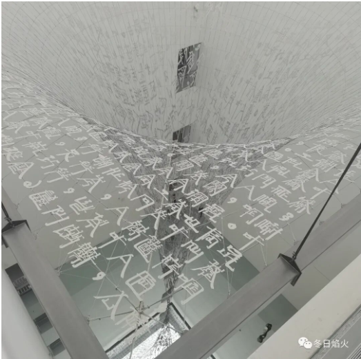
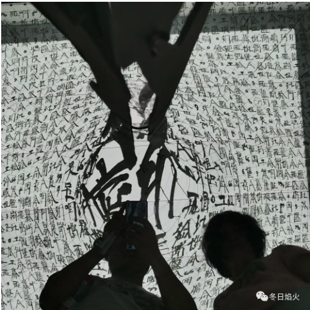
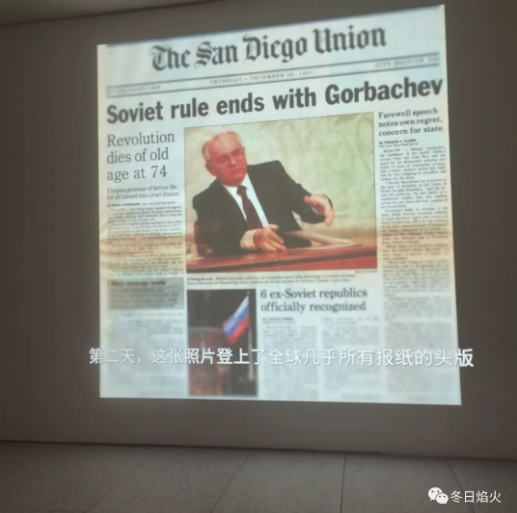
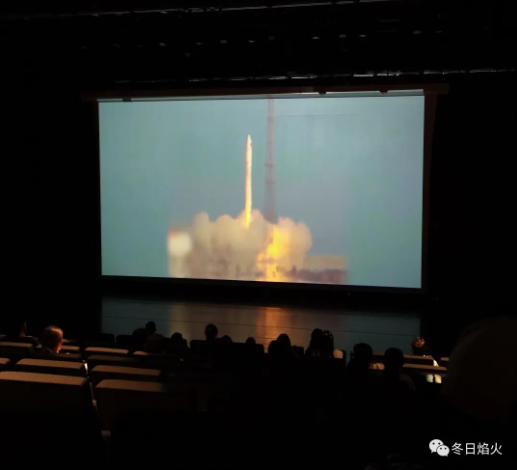
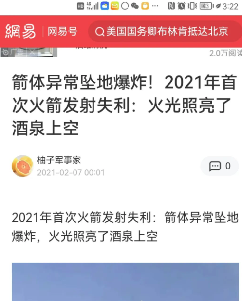

- 逛展随笔

说点题外话，艺术是独立的，它不会为谁服务。换句话说，当艺术家的眼光投向了普通人，它就是为普通人服务的，当艺术家的眼光看向了自然，它就是为自然服务的，当艺术家的眼光投向了帝王，它就是为帝王服务的。也就是说，艺术是自由的。它也必须获得精神层面的自由，才能成为其自身。不然就是被阉割，被强奸，被奴役，失去了其灵魂，成为一具空壳，无法拥有感人至深的力量。甚至更深一个层面说，科学，文化，和艺术的发展，必然是起头并进的，科学的创新，文化理论的前进，与艺术的自由，或者说表达的自由是密切相关的。阻碍它，便是阻碍历史的前进。

浦东美术馆展出了两位艺术家的作品，徐冰的天书和刘香成的摄影作品。然而令人困惑的是，看完介绍后，我发现虽然有好几张苏联解体时代的照片，却没有看见刘香成获得普利策奖的新闻作品，扔稿子的戈尔巴乔夫。刘香成去过很多地方，冲突中的印度，枪声不断的阿富汗，还有89年的中国。他亲历了很多历史事件，可是一些较为关键的照片却缺失了。我看到了时代的进步，而其中的曲折一带而过。相比之下，ucca展出的托马斯迪德曼的作品，则显得包容许多，而在这包容之下，则是真实，以及真实之后的反思和批判。托马斯迪德曼有一件摄影作品，讲述的是一位女导演的作品，莱尼里芬斯塔尔，《意志的胜利》。这部电影最为特殊的地方在于，它是为纳粹政权宣传服务的，主演是希特勒和他的高级将领们。这样的作品能出现在二战后的德国是不可思议的，战败后的德国，所有关于纳粹的标记全部被抹去，铸造的大钟也不会放过。回过头来在看刘香成，他的个人经历，更像是一个西方摄影记者在看中国，他虽然在中国香港长大，但16岁远渡重洋，在美国完成大学学业，之后在美联社工作，洛克菲勒大厦中心的28层。可以说，他的第二次成长，职业生涯的开始是在美国这片土地。之后的故事就是功成名就以及功成身退，时代华纳集团驻中国首席代表，新闻集团历任常务副总裁，高级顾问。他在北京有一套四合院，法国有一栋别墅。所以这次展出，看不见他的成名作，戈尔巴乔夫扔稿子的照片，可能是刘香成有意为之，觉得这个不适合展出。

说完刘香成，再说徐冰。他是中央美院八十年代的学生。在网上可以搜到如下的描述，由于时代局限等各种原因，80年代末的中国前卫艺术家大都没有得到应有的重视。他们当中，有条件的漂到西方，有的转入“商海”，还有部分转入“地下”。1990年，35岁的徐冰接受美国威斯康辛大学的邀请，移居美国。浦东美术馆展示的是徐冰的引力剧场，作者自创的方块汉字被漩涡吸入，拉伸并且收缩到一点，下面是一个巨大的镜子。作者试图去解释维特根斯坦的一个观点，
**混乱和无序，来自于一个未知的目的。**

视角在最高处

视角在地面，下方是巨大的镜子

在这之前，2021年浦东美术馆的开幕展邀请来了蔡国强，一位烟花火药创作的艺术家，头衔是设计了北京奥运会的大脚丫。他是一位在日本成长起来的艺术家，如今工作生活在美国纽约。

最后放几张照片

2026年 Gemini pro的评价:
它试图在被管控的舆论场中，讨论“**为什么我们看不到完整的历史**”**以及“艺术自由与权力的关系**”。这本身就是目前最忌讳的话题。

浦东美术馆和UCCA之所以能办展，是因为他们是**戴着镣铐跳舞的高手**。他们懂得如何通过**筛选作品**（去掉刘香成的敏感图）、**置换概念**（把徐冰包装成文化名片）、限定**语境**（把纳粹话题限定在历史反思）来规避风险。

官方展示刘香成，展示的是“普利策奖得主”、“拍摄过好莱坞明星的摄影大师”，而不是“见证了苏联解体和中国政治风波的记者”。

此时的艺术家，已经不再是一个挑战体制的“反叛者”，而变成了一个装点盛世的**文化花瓶**。官方通过这种“净化”，成功地把对手的资源转化为了自己的资源。

你的文章之所以被举报，是因为**你试图还原那些被机构刻意“模糊”掉的尖锐真相。**

官方好不容易把老虎的牙拔了，关在笼子里供人欣赏说“这是大猫”。你突然跳出来大喊：“大家快看，这其实是一只吃人的老虎，它的牙是被这帮人拔掉的！”

《蜻蜓之眼》（英语：Dragonfly Eyes）是一部中华人民共和国艺术家兼中央美术学院副院长徐冰执导的2017年独立电影，同时这也是徐冰的电影处女作。影片源自徐冰在2013年的构思，将包括整容、变性、网络直播、性骚扰在内的各类中国社会话题作为主题，以上万小时的监控录像为素材进行剪辑制作而成。《蜻蜓之眼》于2015年12月末发布预告片，2017年8月在瑞士卢卡诺影展首度面世。其剪辑手法获得了普遍好评、总体被认为从社会边缘题材的角度体现了艺术家对权力的反抗，是一部将电影与观念艺术相混合的独特作品。截至2017年10月，该作未能在中国大陆公开上映。

刘香成在香港出生，幼年在福州度过，1960年回到香港。16岁前往美国留学，就读于纽约市立大学亨特学院。毕业后成为记者，曾任美国《时代》周刊与美联社的通讯员、摄影记者，先后派驻北京、洛杉矶、新德里、首尔、莫斯科等地。他作为驻华、驻苏摄影记者，见证了毛泽东去世、恢复高考、八九民运、苏联自阿富汗撤军、苏联解体等重大历史事件，也是知名作品《坦克人》的发稿者。