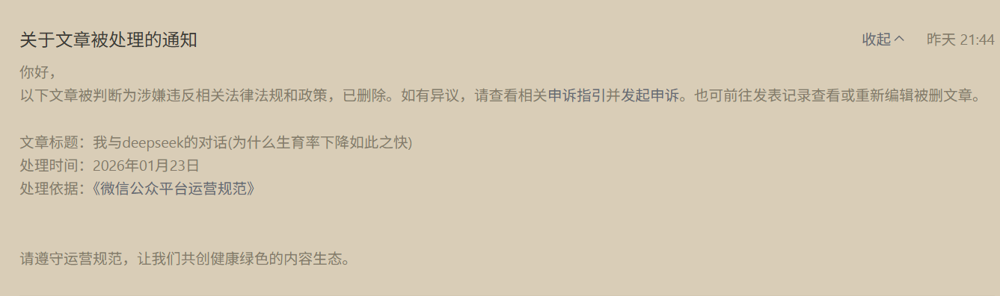

# 我与DeepSeek的对话：为什么生育率下降如此之快

## 一、第七次全国人口普查（2020年）数据分析

### 家庭户规模持续缩小

根据第七次全国人口普查数据，核心家庭人数呈现以下特征：

#### 1. 全国户均人数降至2.62人

七普数据显示，全国家庭户平均规模为**2.62人/户**，较2010年第六次人口普查的3.10人减少0.48人，延续了1982年（4.41人）以来的持续下降趋势。

#### 2. 核心家庭占比结构变化

- **标准核心家庭**（夫妻+未婚子女）占比显著降低：2010年占比约33%，较1990年的53%大幅下降；2020年进一步降至**26.5%**（以户主维度统计）。
- **夫妻核心家庭**（无子女夫妇）比例上升：从2010年的18.56%增至2020年的**21.8%**（户主维度）。特指无子女的夫妇家庭，包括丁克家庭、新婚未育夫妇或空巢后期阶段（子女成年独立后）。

### 家庭类型的结构性转变

#### 1. 一代户成为主导

2020年一代户（含单人户、无子女夫妻）占比达**49.5%**，首次超越二代户（39.95%），成为最主要的家庭类型。

#### 2. 单人户激增

全国单人户数量超**1.25亿户**，占总家庭户的25.4%，比2010年增长超10个百分点。（也称为一人户或单身户，是指在家庭结构中仅有一个成员独立生活，且无其他共同居住或共同生活的家庭成员的单位）

#### 3. 三代及以上家庭占比萎缩

三代直系家庭占比降至**14.7%**（户主维度），乡村三代户比例高于城镇但降幅更大（较2010年下降6.44个百分点）。

---

## 二、为什么生育率下降如此之快？

生育率快速下降是全球性趋势，但中国等东亚国家尤为突出，其背后是多重结构性因素的交织作用。

### 一、经济成本压力：抑制生育意愿的首要因素

#### 生育养育教育成本畸高

中国生育成本（含孕育、养育、教育支出）在全球排名前列，远超多数发达国家。从孕期保健到子女教育，家庭需承担巨额支出，导致年轻群体主动推迟或放弃生育。

#### 工作与收入不稳定加剧经济焦虑

就业竞争激烈、收入增长放缓背景下，育儿带来的职业中断风险（尤其对女性）与经济负担形成双重压力，进一步降低生育可行性。

### 二、社会文化变迁：家庭观念与个体价值重构

#### 城市化消解传统家庭功能

密集的高楼住宅弱化了家族纽带和育儿支持网络，居住空间局促且缺乏代际互助，"家"逐渐沦为夜间栖息的"格子笼"，生育失去传统文化根基。

#### 个人主义兴起与女性意识觉醒

女性受教育程度提升和职业发展诉求增强，使生育与自我实现的冲突凸显。东亚社会普遍出现"重个人生活质量、轻生育责任"的价值观转向。新加坡李显龙指出，即使政策放开生育，东亚人群自愿多生的比例仍极低。

### 三、技术替代与人口价值转型：生育动力的根本削弱

#### 劳动力价值被技术大规模替代

农业机械化（如无人机替代40人劳作）、服务业智能化（如AI客服替代千人岗位）等现象，显著降低人力创造财富的边际效用。社会更关注个体的"消费能力"而非"生产能力"，生育的经济回报急剧萎缩。

#### 福利制度改变生育逻辑

高福利国家中，福利与工作报酬比可达1:2，生存保障不再依赖子女赡养，进一步瓦解"养儿防老"的传统生育动机。

### 四、中国特有的加速机制：政策与竞争的叠加效应

#### 历史政策遗留影响

长期计划生育政策形成少子化思维定式，即使政策放开，惯性仍持续抑制生育意愿。

#### 教育内卷与住房压力

学区竞争白热化、课外教育投入攀比，叠加房价收入比畸高，形成"生育恐惧链"。北京、四川等多地2025年数据显示，生育登记降幅超30%，住房成本被公认为核心抑制因素。

#### 生育支持体系缺位

相较于发达国家，中国在生育补贴、托幼服务、职场性别平等保障等方面仍显不足，政策落地滞后于现实需求。

### 五、人口结构恶性循环：低生育率自我强化

结婚率持续走低（2024年上半年同比减少14.7%）导致育龄基数萎缩，而生育延迟又进一步压缩窗口期。如2025年预测所示，中国出生人口将跌破900万，形成"结婚少→生育少→未来育龄人口更少"的螺旋。

---

## 三、城市化消解传统家庭功能的深度分析

### 一、家庭结构的碎片化：从扩展家庭到原子化单元

#### 1. 核心家庭成为主流模式

城市化推动年轻夫妇脱离多代同堂的聚居模式，选择独立居住的小家庭结构。2024年数据显示，中国家庭平均成员数持续下降，"夫妻+未成年子女"的核心家庭占比达76%，传统宗族式大家庭加速解体。

#### 2. 流动家庭规模扩大

人口跨区域迁移导致家庭成员分散在不同城市，形成"父母留守农村、子女定居城市""夫妻异地务工"等分离形态。此类家庭因物理分隔丧失共同生活基础，血缘纽带被地理距离割裂。

#### 3. 家庭类型多元化

单身家庭、丁克家庭、同居家庭等非传统形态涌现。2025年统计显示，中国单人户家庭占比超25%，婚姻不再是家庭组建的必要前提。

### 二、家庭功能的外部化：从自足单元到依赖社会系统

| 传统功能 | 城市化后的替代主体 | 典型案例 |
|---------|------------------|---------|
| 生产经营（农业/手工业） | 企业雇佣/市场化服务 | 家庭作坊被工厂取代 |
| 养老保障 | 社保体系/养老机构 | 农村空巢老人依赖养老金 |
| 子女教育 | 学校/培训机构 | 课外辅导替代家庭教育 |
| 情感支持 | 心理咨询/社交媒体 | 青年更倾向向网友倾诉 |

### 三、家庭关系的疏离化：亲缘纽带被理性计算瓦解

#### 1. 代际支持弱化

老年父母与成年子女分居两地，传统赡养义务因空间隔离难以履行。农村留守老人占比超40%，城市独居老人达28%，代际互助机制名存实亡。

#### 2. 亲缘交往"断链"

- **物理断链**：超60%人群因搬迁与亲戚失去联系
- **情感断链**：青年与亲戚交往频次年均不足3次，内容局限于礼节性问候

#### 3. 情感联结脆弱化

家庭关系从"责任共同体"转向"利益计算体"。调查显示，52%年轻人认为亲情维系成本（时间/金钱）高于收益，亲属冲突中财产纠纷占比达68%。

### 四、家庭价值的重构：个体主义消解集体伦理

#### 1. 生育逻辑根本变革

"养儿防老"经济动机被社保体系瓦解，生育更多关联个人价值实现。2025年数据显示，核心家庭生育意愿仅为传统家庭的1/3。

#### 2. 婚姻契约属性强化

婚姻被视为"经济合作社"，73%受访者认为配偶收入水平比感情深度更重要。离婚率在人口流入型城市达35%，反映家庭稳定性下降。

---

## 四、本质矛盾与未来展望

### 本质矛盾：城市化撕裂家庭的双重属性

传统家庭兼具**生产单元**与**情感容器**双重角色，而城市化通过三重机制解构其功能：

- **空间压缩**：高密度居住环境剥夺家族聚居物理基础
- **时间剥夺**：通勤与工作时长挤压家庭成员互动时间
- **价值冲突**：个人发展优先级超越家庭集体利益

**最终后果**：家庭退化为"夜间栖息格子笼"，其经济互助、文化传承、风险抵御等社会功能被市场与政府接管，传统家庭伦理在个体主义浪潮中逐渐悬浮。

### 专家观点

《行将到来的世界改革》一书的作者菲迪南德·伦德伯格指出："家庭正濒于灭亡的边缘。"心理分析学家威廉·沃尔夫也认为："除了照顾出生一两年的婴孩之外，家庭已经名存实亡。"

尽管时代的变革、技术的迭代可为人类带来光辉前景，然而一切事物均具有两面性。家庭单元被解构的负面作用也是显而易见的。

比如它为人类创造了新的家庭形式，却解构了人类传统的家庭结构；它通过人机系统和人造子宫改变了人类的生育方式，却削弱了父母子女间的血缘关系和水乳交融的至爱亲情。

面对越来越复杂的情感和关系状态，也许可以推出一个新的"**共居制**"，男男、男女、女女，无关性别，无关对婚姻的态度，只要是能承担民事行为能力者都可以通过这个制度搭建一个共同生活的家庭。

### 亲缘关系的客观规律

民间俗语"一代亲，二代表，三代了"揭示了亲缘关系随代际更迭淡化的客观规律。第七次全国人口普查数据显示，家庭户均人口从2010年的3.10人降至2.62人，独生子女家庭增多进一步加剧了"亲不过二代"的紧缩化趋势，血缘关系网络逐渐单薄。

---

## 五、应对建议与结论

### 教育层面的建议

1. 家长需注重培养孩子的独立性和创造力，营造健康、和谐的成长环境，通过平等对话和尊重孩子意见的方式，主动学习育儿知识和教育方法，提升自身教育素养。

2. 优化家庭教育资源配置。政府和社会各界应提供丰富的教育资源和服务，确保教育公平，社区应发挥自身优势，为家庭创造更好的教育环境和条件。

3. 增强家庭教育互动学习。家长应多陪伴子女，深入交流互动，了解子女需求，增强亲子关系，共同参与家庭活动，增进情感联系和默契度。

4. 建立家校合作机制。学校与家长应保持常态化沟通，邀请家长参与学校活动和教学改革，共同商讨教育策略。

### 结论：系统性危机需系统性应对

生育率断崖非单一因素所致，而是经济高成本、技术替代劳动力、文化范式更迭、政策制度缺位的**共振结果**。中国的特殊性在于：

- 城市化压缩了发达国家百年的观念转变进程
- 教育医疗等公共资源分配不均加剧焦虑
- 政策调整未能及时对冲市场机制的负面效应

若不构建涵盖成本分摊（如生育补贴）、性别平等（职场保障）、居住正义（保障房供给）的系统方案，低生育率趋势恐难逆转。

### 乡村独居危机的破解

一人户激增本质是城市化对传统家庭的撕裂，但农村承受了更剧烈的阵痛：

- **被动性更强**：城市一人户多源于个体选择自由（如独立居住），乡村则因青壮年流失、养老缺位被迫独居
- **脆弱性更高**：低保障水平使乡村独居老人陷入"医疗无援、情感孤立"的双重困境
- **代际传递更隐蔽**：农村单身男性积累形成未来"无家庭养老储备"的孤老群体

**破解关键**在于重建乡村支持网络：通过土地流转收益反哺养老、探索"互助养老合作社"模式、强化基层医疗巡诊，避免统计数字背后的生存危机继续恶化。